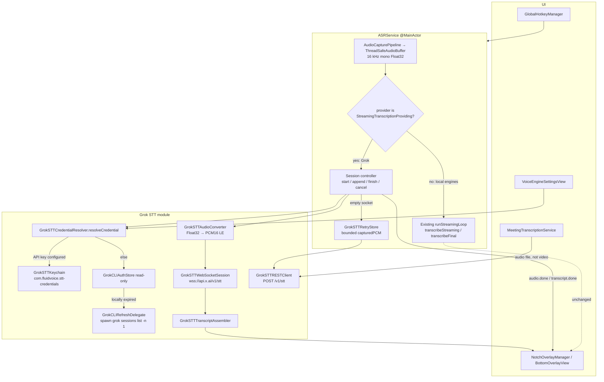

# FluidVoice × xAI Grok Streaming Speech-to-Text

| Field | Value |
|---|---|
| **Title** | Handoff-ready architecture for xAI Grok streaming STT in FluidVoice |
| **Author** | FluidVoice Grok STT design (agent-authored) |
| **Date** | 2026-08-27 |
| **Status** | Draft |
| **Repo** | `/Users/ben/projects/ben-vargas/ai-fluidvoice` (`main` @ `c36eee6`) |
| **Host strategy** | Personal fork. Opt-in engine, never default. Minimize core-file diffs so the fork rebases cleanly. Upstream issue/discussion/PR timing is **out of scope**. Do not wait on [altic-dev/FluidVoice#820](https://github.com/altic-dev/FluidVoice/pull/820). |
| **Audience** | Implementing agent + senior FluidVoice engineers |

This document is the implementation contract. An implementing agent must be able to build from it without re-deriving the 2026-08-27 research. Locked product decisions are **not** reopened here.

---

## Overview

FluidVoice today is a local-first dictation environment. `SettingsStore.SpeechModel` selects an on-device or Apple engine; `ASRService` captures 16 kHz mono `Float32` PCM, optionally runs a timer-based pull loop (`transcribeStreaming` on growing prefixes), and on hotkey release re-transcribes the whole buffer with `transcribeFinal`. The overlay’s `partialTranscription` is display-only. The selected “xAI” item in AI Enhancement is chat completions (`https://api.x.ai/v1/chat/completions`) — audio never leaves the machine for speech recognition.

This design adds a new, opt-in **cloud speech engine**: **Grok Speech (xAI)**. Dictation uses **WebSocket streaming STT** at `wss://api.x.ai/v1/stt` so the live overlay updates while the user speaks **and** while they pause mid-recording with the hotkey still held. The socket is **authoritative**: accumulated `transcript.partial` segments plus `transcript.done` after `audio.done` is the inserted text. REST `POST https://api.x.ai/v1/stt` is used only for (a) meeting/file transcription and (b) retry when the socket produced nothing.

Credentials v1: user-owned xAI API key (Keychain, documented) plus a read-only Grok CLI session from `~/.grok/auth.json` (experimental, undocumented). A `resolveCredential()` seam is shaped so PR 820’s in-app device flow can be added later as a second implementation; it is **not** built now. STT credentials are **separate** from AI-enhancement xAI/Grok keys.

---

## Background & Motivation

### Current state (what the implementer must not break)

| Layer | Today | File / symbol |
|---|---|---|
| Engine catalog | Local/system only: Parakeet, Nemotron, Cohere, Qwen (hidden), Apple Speech, Whisper | `SettingsStore.SpeechModel` (`SettingsStore.swift:4557`) |
| Provider seam | Pull protocol `[Float] → ASRTranscriptionResult` | `TranscriptionProvider` (`TranscriptionProvider.swift:129`) |
| Engine switch | `selectedSpeechModel` → cached provider; **unknown cases become Whisper** | `ASRService.transcriptionProvider` (`ASRService.swift:352-379`) |
| Capture | Core Audio or AVAudioEngine → 16 kHz mono `Float32` ring | `ThreadSafeAudioBuffer`, `AudioCapturePipeline` |
| “Streaming” | Timer loop snapshots prefix, calls `transcribeStreaming` | `runStreamingLoop` (`ASRService.swift:4594-4818`) |
| Overlay | `asr.$partialTranscription` → `NotchOverlayManager.updateTranscriptionText` | `MenuBarManager.swift:117-137` |
| Insert | `ContentView` awaits `asr.stop()` → `transcribeFinal` result | `ASRService.swift:2324`, `ContentView.swift:2146` |
| Stop PCM | `getAll()` then `clear()`; in-scope `capturedPCM` dies with `stop()` on failure | `ASRService.swift:2419-2421`, `:2599-2630` |
| Meetings | Native `transcribeFile` if `prefersNativeFileTranscription && !isVideoContainer` | `MeetingTranscriptionService.swift:487-513` |
| xAI today | LLM enhancement only; Keychain service `com.fluidvoice.provider-api-keys`, provider id `"xai"` | `KeychainService.swift`, `ModelRepository.swift:40` |
| Sandbox | `ENABLE_APP_SANDBOX = NO` | `project.pbxproj` |

### Pain this change addresses

Local engines cost 0.4–2 GB RAM and CPU for the entire dictation session. The user wants FluidVoice’s surrounding product (hotkey, overlay, dictionary, command/write, meetings, history) **without** a local ASR model, using a Grok subscription they already pay for, with live overlay.

### Why WebSocket first (not REST-on-stop)

Three user-selectable engines already skip live preview (Whisper medium / large-turbo / large). REST-on-stop would match that UX, but the user explicitly requires **live overlay while speaking and while paused mid-recording**. FluidVoice’s overlay holds text during a mid-utterance pause because the pull timer keeps re-decoding the same prefix. A socket with `interim_results=true` is the cloud equivalent: partials keep arriving; on silence they stabilize; recording still ends only on hotkey release.

### What this is not

- Not Apple Speech / Apple Speech Analyzer, and **no auto-fallback** to Apple on STT failure.
- Not PR 820. That PR is subscription **LLM** login (`GrokSubscriptionAuth`, provider id `xai-grok-subscription`, chat proxy `cli-chat-proxy.grok.com`). Zero `/v1/stt` / WebSocket. ~95 commits behind `main`. Do not depend on it merging. Do not reuse its provider id for STT.
- Not a REST-first milestone. REST exists, but dictation is a session socket.

---

## Goals & Non-Goals

### Goals (v1)

1. Opt-in `SpeechModel` case **Grok Speech (xAI)**; never the default (`defaultModel` stays Parakeet TDT / Whisper Base). Never auto-selected on first launch or in onboarding. A user must open Voice Engine settings, pick this engine, and configure a credential.
2. WebSocket dictation: one socket per recording; wait for `transcript.created`; ~100 ms / 3200-byte PCM16 frames; last-write-wins partials; hotkey release → `audio.done`; insert assembled transcript.
3. Live overlay during recording, including pause-in-speech (hotkey held, user silent). Socket transcript is what is inserted (changes today’s “preview is disposable” contract **for this engine only**).
4. Credential resolver: API key (Keychain) wins if configured; else read-only Grok CLI store + delegated `grok sessions list -n 1` refresh. Seam can grow a device-flow implementation later.
5. Visible failure + bounded PCM retry store + Retry. REST retry **only if the socket produced nothing**.
6. Meetings/files: REST `POST /v1/stt` via `prefersNativeFileTranscription` / `transcribeFile(at:)`. No silent video-container upload; video extract+REST only after an explicit “extracted audio will be sent to xAI” notice. No xAI `diarize`. Local diarizer stays on the local-engine path. LocalAPI `/v1/transcribe` is a third cloud path when Grok is selected.
7. Privacy copy rewritten (both Info.plist strings **and both** README Local-First sentences, lines 112 and 263). Engine picker states that audio is sent to xAI.
8. Dictionary replacements still applied post-hoc; `keyterm` bias from canonical replacements + vocab `Term.text`, cap 100 × 50. Pronunciation-enrollment / dictionary-training UI unreachable.
9. **Low-invasiveness / rebaseable fork.** Almost all new types live in `Sources/Fluid/Services/GrokSTT/` plus `StreamingTranscriptionSession.swift`. `ASRService` / `ContentView` / `SettingsStore` / overlay get **small, named branch points only** — no drive-by cleanup of the local ASR path. Goal: a personal rebase onto upstream `main` should conflict in a handful of obvious switch/if sites, not in rewritten 200-line functions.

### Non-Goals (v1)

- Apple Speech / Analyzer as fallback or as this feature.
- PR 820 in-app device flow (`GrokSubscriptionAuth`).
- Reusing LLM provider id `xai` or `xai-grok-subscription` for STT.
- Writing `~/.grok/auth.json` or parsing/using `refresh_token`.
- Bundling an xAI API key.
- Server endpointing / `smart_turn` auto-stop.
- Silent failover subscription → API key after an error (billing change).
- Silent failover cloud → local engine.
- xAI `diarize`, multichannel, Opus encoding.
- Refactoring all providers to sessions.
- Hiding the socket behind `transcribeStreaming([Float])`.
- Claiming SuperGrok / unmetered STT. Subscription STT is **undocumented**; label the CLI path experimental.
- Sandbox entitlements (app is unsandboxed today; note the future risk only).
- Changing local-engine start/stop/cancel behavior.
- Upstream issue vs discussion vs PR process (the user will decide later, after seeing the core-file diff size).
- Auto-enabling Grok STT for anyone.

---

## Key Decisions

These are **final**. Implement them; do not re-litigate.

| ID | Decision | Rationale |
|---|---|---|
| Host | FluidVoice personal fork. Opt-in only, never default, never onboarding. Minimize core-file invasiveness so the fork rebases. | Cloud STT is a personal enhancement. Upstream process is out of scope. Do not wait on PR 820. |
| Transport | **WebSocket first** `wss://api.x.ai/v1/stt` | Live overlay while speaking and while paused mid-recording. REST is meetings + empty-socket retry only. |
| Credentials v1 | **A** — Grok CLI `~/.grok/auth.json` read-only + xAI API key as documented fallback. Design `resolveCredential()` so **B** (PR 820 device flow) can drop in later; do not implement B. | CLI-store Bearer was live-probed on REST (HTTP 200, 2026-08-27). Device-flow token is a different grant, unproven on STT. |
| Inserted text | **2C** — socket is authoritative (accumulate partials, `audio.done` on stop, insert `transcript.done` / assembled text). REST retry **only if the socket produced nothing**. | Avoids double-upload, double-bill, and extra latency. Safety net when the socket dies before any text. |
| Utterance end | **3A** — hotkey release → `audio.done`. No server endpointing / `smart_turn` auto-stop. | Preserves FluidVoice push-to-talk muscle memory. `speech_final` is ignored for termination. |
| Failure | **4A** — visible error, persist PCM beyond `stop()`, Retry. No silent local-engine switch. | Cloud fails after the user has spoken. Silent Parakeet reload would defeat the RAM reason for cloud. |
| Meetings | **5A** — REST `POST https://api.x.ai/v1/stt` via `prefersNativeFileTranscription` / `transcribeFile(at:)`. No silent video upload. No xAI `diarize`. | Native 500 MB file path removes 20-minute local chunking for audio. Video stays extracted locally; containers are not POSTed. |
| STT vs LLM keys | **7A** — STT credentials separate from AI-enhancement xAI/Grok keys. Do not reuse `xai-grok-subscription`. | Billing isolation. PR 820 is LLM-only. |
| Auth store | Never write `auth.json`. Never parse/use `refresh_token`. Refresh by spawning `grok sessions list -n 1` (never kill the child; pin `GROK_AUTH_PATH`; single-flight). | Second writer can burn the token family. bb plugin is the proven pattern. |
| Path resolution | Defined `GROK_AUTH_PATH` is literal even if empty; else `$GROK_HOME/auth.json` (empty `GROK_HOME` falls back); else `~/.grok/auth.json`. | Match grok-build / bb exactly so the spawned CLI and the reader cannot disagree. |
| Entry pick | bb scoring: rotated > self-consistent `issuer::client` > unexpired > file order. 300 s early-expiry buffer. | Quill’s “newest `create_time`” is the wrong algorithm after rotation. |
| 401 / 403 | On 401: try **one** other unexpired store entry. Never spawn refresh on 401. Never retry 403. | CLI `try_ensure_fresh_auth` fast-paths a locally-valid token; a spawn would not help and is a mid-exchange hazard. |
| Precedence | API key **wins** over CLI token if the user configured an STT API key. No silent failover after error. | Same as Quill/bb. Failover would change billing. |
| Client keys | Native user-owned credential is a **conscious deviation** from xAI’s “proxy WebSockets / don’t put keys in clients” warning. Never bundle a key. | Same deviation Quill and Grok Build already make. Document it in-app. |
| Socket start | Wait for `transcript.created` before sending audio. **Do not** copy Quill’s `didOpen` flush. | Current xAI docs (2026-08-27). |
| Frames | ~100 ms / 3200-byte PCM16 @ 16 kHz. | xAI streaming tip; model-native rate. Capture is already 16 kHz mono. |
| Partials | Last-write-wins per `start`. Empty interims must not wipe text. | Quill `STT.swift` hard-won rule. Server emits `is_final` twice with identical text. |
| `keyterm` | Canonical dictionary **replacements** + vocab `Term.text`, not mishearing **triggers**. Cap 100 × 50. Keep `applyCustomDictionary` after. | Triggers would bias toward the mishearing. |
| Language | Dedicated persisted xAI STT setting (`nil` = Auto). Map FluidVoice `tl` → xAI `fil`. Omit/disable Chinese (`zh`). Do not claim auto-detect covers Chinese. | xAI documented 25 codes. FluidVoice catalog uses `tl`. `zh` is not in xAI’s table. |
| SpeechModel landmines | Explicit `supportsStreaming = true` (this engine **is** streaming). `isWhisperModel = false`. `isInstalled = true`. `modelsExistOnDisk() = false`. Neither Download nor Delete. Do not fake `usesAppleLogo`. Add `hasRemovableLocalArtifacts` / `isCloudEngine`. | Defaults: unknown `transcriptionProvider` → Whisper; unknown `isWhisperModel` → true; unknown `isInstalled` → Whisper file check → false → Download button; installed + `!usesAppleLogo` → trash. `modelsExistOnDisk() == true` makes `prepareProviderWithRecovery` double-`prepare`. |
| `isReady` | Stay true once a credential **source** is configured. Do not flip false on expiry/offline. Runtime failures throw from session methods. | `ASRService.swift:2509-2519` returns `""` with no UI if `isReady` is false; `:4671` skips chunks the same way. |
| Overlay | Live preview during recording. For this engine, socket text is inserted. | Product requirement. Local engines keep today’s preview-then-`transcribeFinal` path. |
| Training UI | Dictionary-training / pronunciation enrollment unreachable for this engine. Gate Train composer **and** recorder on `supportsPronunciationMatching` (false for Grok). | FluidAudio-only encoder features. Protocol default would route training through `transcribeFinal` (cloud). `CustomDictionaryView` always shows the recorder today. |
| Logging | Never put tokens / `Authorization` in `NSError.userInfo` or cURL dumps. | `stop()` logs `nsError.userInfo` (`ASRService.swift:2601-2605`). |
| Reconnect | Before `transcript.created`: reconnect fresh (no audio sent). After first `append`: do **not** replay. Keep capturing until hotkey-up; insert assembler if non-empty, else REST. | Replay double-bills and re-segments. Empty-socket REST is the safety net. |
| `start()` is non-throwing | After first PCM, `ASRService.start()` returns `.started` immediately. Session connect/`transcript.created` runs **concurrently**. Never `try await session.start()` out of `start()`. | `start()` is `async -> AudioCaptureStartOutcome` (`ASRService.swift:1716`). ContentView does not await created (`ContentView.swift:3251-3266`, `:3923-3948`) and kicks `ensureAsrReady()` in **parallel** (`:3269-3278`). A 20 s await would overflow a 2 s pre-ready buffer and abort capture before `stop()`. |
| Pre-ready PCM / catch-up | Combined connect+created budget **20 s**. Keep capturing in `audioBuffer` while `isRunning`. **One catch-up owner:** the **pump** is the only loop that `append`s during recording. The sibling `session.start()` Task **only** sets `createdReceived` (or `sessionTransportError`); it never sends PCM. On first `createdReceived` pump tick, `sentCursor` is 0 → send `audioBuffer[0..<capturedCursor]`, then live. After `stop()` copies/clears the ring, catch-up source is **`capturedPCM` only** — `finish()` must not read `audioBuffer`. | Two senders would duplicate PCM on the socket (assembler keys by server `start`, so words duplicate). `stop()` clears the live ring before `finish()`. |
| Stop algorithm (2C, single path) | `finish()` → if assembler non-empty, insert it (no REST). If empty, **one** REST `transcribeFinal(unpadded capturedPCM)`. If REST throws/empty, `retain` + visible Retry. | Split-brain pseudocode vs paragraph would skip auto-REST. REST uses **unpadded** PCM (session path skips the Whisper 1 s pad). |
| Isolation | `GrokSTTProvider` / `StreamingTranscriptionProviding` are **not** `@MainActor`. Session + URLSession delegate + REST live off-main. Hop `onPartial` to MainActor only. `append` must not be awaited on MainActor. | `TranscriptionExecutor` is a private actor (`ASRService.swift:14-40`). MainActor provider + executor `run { transcribeFinal }` deadlocks. 20 ms pump on MainActor hitches the overlay. |
| Overlay hide-before-stop | When `isCloudSessionActive \|\| hasPendingSTTRetry`, **do not** set `shouldHideOverlayOnStop`. Keep overlay through `stop()` / REST / Retry. | Default dictation hides the overlay **before** `asr.stop()` (`ContentView.swift:2108-2125`). `"Transcribing"` is only written if the overlay stays up (`:2127-2133`). |
| `isCloudSessionActive` | `transcriptionProvider is StreamingTranscriptionProviding && (isRunning \|\| isStarting \|\| activeStreamingSession != nil)`. True even if `makeStreamingSession` failed and the session object is nil. | `try?` leaving `session == nil` would hide the overlay at key-up for the failure that most needs Retry. |
| `performEnsureAsrReady` | Cloud arm: never set `isDownloadingModel`; start in `.loading`; still pass `modelsAlreadyCached: false`. | `modelsExistOnDisk() = false` otherwise takes the download branch (`:4209-4256`) and the card shows “Preparing download...”. |
| Pump errors | `sessionPumpTask` is `Task<Void, Never>`. Socket errors set a sticky `sessionTransportError`; do not throw through `Never`. Do not abort PTT. | Mid-hold drop must keep capturing for REST-at-stop. |
| Catalog restore | If Grok is hidden or has no credential source, `selectedSpeechModel` getter falls back to `SpeechModel.defaultModel` (same pattern as Qwen, `:5741-5743`). | Restoring a backup with `grok-stt` during a hidden-catalog PR must not become Whisper via `default:`. |
| CLI-socket if L4 fails | Ship API-key WebSocket. Disable CLI-socket in settings; CLI REST still allowed. Do **not** silently REST-on-stop as the dictation path. | Already specified in Rollout / Risks. Not an open product question. |
| Display name | `Grok Speech (xAI)` | Locked in the SpeechModel table. |

### Conscious deviation (must appear in engine UI)

xAI STT docs (2026-08-27): *“Never expose your API key in client-side code. Always proxy WebSocket connections through your backend.”* FluidVoice is a native unsandboxed Mac app presenting a **user-owned** Keychain key or the user’s own Grok CLI token. That is a documented-warning deviation, not vendor permission. Mitigations: never bundle a shared key; never log secrets; STT keys ≠ LLM keys; label Grok-session mode experimental. xAI ephemeral tokens (`/v1/realtime/client_secrets`) are for Speech-to-Speech at `wss://api.x.ai/v1/realtime`, **not** for `/v1/stt` — do not use them.

---

## Proposed Design

### Architecture



Local engines never enter `SessionCtrl`. The blast radius in `ASRService` is a branch at start / stop / cancel, plus a cached `grokSTTProvider` alongside the existing provider caches.

### New types / protocols (exact signatures)

Add `Sources/Fluid/Services/GrokSTT/` (Xcode uses `PBXFileSystemSynchronizedRootGroup` — files under `Sources/Fluid` are picked up automatically). Tests under `Tests/FluidDictationIntegrationTests/` are **not** synchronized (`project.pbxproj` PBXFileReferences); every new test file must be added to the FluidDictationIntegrationTests target.

#### Isolation (non-negotiable)

`ASRService` is `@MainActor` (`ASRService.swift:94-95`). `TranscriptionExecutor` is a private `actor` (`:14-40`) used for `transcribeFinal` / `transcribeFile` (`:2532-2534`, `:2698-2700`). Local providers are **not** MainActor. If `GrokSTTProvider` were MainActor-isolated, `transcriptionExecutor.run { await provider.transcribeFinal }` would hop executor → MainActor while `ASRService` (MainActor) awaits the executor: **deadlock**. LocalAPI `/v1/transcribe` uses that path (`InferenceAPIController.swift:46-58`). Meetings `transcribeFile` on a MainActor provider would also pin a 600 s REST to the UI thread.

Therefore:

- `TranscriptionProvider` remains nonisolated (as today).
- `StreamingTranscriptionProviding` is **not** `@MainActor`.
- `GrokSTTProvider` is a regular class; REST methods are `nonisolated` / actor-callable.
- `GrokSTTWebSocketSession` lives on a dedicated serial queue (URLSession delegate queue). Assembler is mutated only there.
- `onPartial` is a boxed `@MainActor (String) -> Void` set from ASRService; the session hops with `Task { @MainActor in }`.
- `append(pcm16:)` is fire-and-forget from the pump’s point of view: enqueue on the session queue and return. Do **not** `try await` WebSocket send on MainActor. Backpressure **after** `created`: if the send queue exceeds ~20 frames, **pause the pump** (do not enqueue, do not drop). Drop-oldest after `created` would truncate the socket transcript and 2C would skip REST. Catch-up on `created` is the pump sending `audioBuffer[0..<cursor]` (`sentCursor` starts at 0), never a drop-oldest window. The sibling Task does not send. After stop, catch-up is `handoffUnsentPCM(capturedPCM)`.
- Session type is `AnyObject` (needed for URLSession delegate) but **not** `Sendable`. ASRService holds it as a MainActor-isolated reference to an off-main object; crossing the boundary is via the session’s own queue methods.

#### `StreamingTranscriptionSession.swift`

```swift
import Foundation

/// Push-based live transcription. Parallel to pull `TranscriptionProvider`.
/// Adopted only by cloud session engines. Local engines do not conform.
/// NOT @MainActor — REST via TranscriptionExecutor would deadlock if it were.
protocol StreamingTranscriptionProviding: TranscriptionProvider {
    func makeStreamingSession(
        configuration: StreamingSTTSessionConfiguration
    ) throws -> StreamingTranscriptionSession
}

struct StreamingSTTSessionConfiguration: Sendable, Equatable {
    var sampleRate: Int
    var languageCode: String?          // nil = Auto (omit query param)
    var keyterms: [String]             // already capped 100 × 50
    var interimResults: Bool           // true for dictation overlay

    static let grokDictation = StreamingSTTSessionConfiguration(
        sampleRate: 16_000,
        languageCode: nil,
        keyterms: [],
        interimResults: true
    )
}

/// One dictation = one session. Not reused across recordings.
/// Isolated to the session’s URLSession delegate queue, not MainActor.
protocol StreamingTranscriptionSession: AnyObject {
    /// Last-write-wins assembled text. Empty interims are suppressed by the assembler.
    /// Thread-safe snapshot (session queue lock).
    var transcript: String { get }

    /// Sticky transport error for the pump (`Task<Void, Never>` cannot throw).
    var transportError: GrokSTTError? { get }

    /// Fires on every non-empty assembled snapshot. Session hops to MainActor.
    var onPartial: (@MainActor (String) -> Void)? { get set }

    /// Connect + wait for `transcript.created`. Safe to call off-main.
    /// Does not send audio. Reconnects once on HTTP-upgrade 401 (CLI alternate Bearer).
    func start() async throws

    /// Enqueue a binary PCM16 LE frame (non-blocking). Legal **only in `streaming`**
    /// (`transcript.created` received, `finish`/`cancel` not yet called).
    /// Must not be awaited on MainActor. No-op (debug assert) if called in `waitCreated`.
    func append(pcm16: Data)

    /// WaitCreated only. Store unsent Float32 (the **entire** utterance). Replaces any
    /// previous handoff. `finish()` will convert and send from sample 0 after `created`.
    /// Illegal in `streaming` (pump already sent `0..<sentCursor`). Does not read
    /// `ASRService.audioBuffer`.
    func handoffUnsentPCM(_ samples: [Float])

    /// Send `{"type":"audio.done"}`, wait for `transcript.done` (or timeout with non-empty
    /// assembled text = success). Returns assembled / server text. Throws if nothing produced.
    /// Never reads `ASRService.audioBuffer`. If `handoffUnsentPCM` was called, send that
    /// copy from sample 0 after `created`, then `audio.done`.
    func finish() async throws -> String

    /// Drop the socket. Do not send `audio.done`. Idempotent. Does not wait for close.
    func cancel()
}
```

`GrokSTTProvider` conforms to `TranscriptionProvider` **and** `StreamingTranscriptionProviding`. No other shipping provider conforms to the session protocol. `makeStreamingSession` / `session.start()` **must** call `resolveCredential()` (single-flight with `prepare`) so first-PTT works when `isAsrReady` is still false.

#### Why a parallel protocol (not hiding the socket)

`TranscriptionProvider` is nine `[Float] → String` methods with no session lifecycle (`TranscriptionProvider.swift:129-175`). Hiding the socket behind `transcribeStreaming(prefix)` would make the prefix argument a lie and would still run `runStreamingLoop`’s 0.6 s timer. Refactoring every local engine to sessions is out of scope. Branch at `ASRService` start/stop/cancel; local path untouched.

### `ASRService` branch — start / stop / cancel

Local engines **keep today’s path**. Grok is detected by `provider as? StreamingTranscriptionProviding` (not by a `SpeechModel` enum compare in every method, so a future session engine can reuse the branch).

Add:

```swift
private var grokSTTProvider: GrokSTTProvider?
private var activeStreamingSession: StreamingTranscriptionSession?
private var sessionPumpTask: Task<Void, Never>?
private var sessionPumpCursor: Int = 0          // samples already considered for send/catch-up
private var sessionTransportError: GrokSTTError? // sticky; set even when session is nil
private let grokRetryStore = GrokSTTRetryStore()

var isCloudSessionActive: Bool {
    self.transcriptionProvider is StreamingTranscriptionProviding
        && (self.isRunning || self.isStarting || self.activeStreamingSession != nil)
}
var hasPendingSTTRetry: Bool { self.grokRetryStore.hasPending }
```

`sessionTransportError` lives on **ASRService**, not only on the session object. `makeStreamingSession` failure must still populate it. Clear both at the start of each recording.

Nil **and cancel** in both `resetTranscriptionProvider()` (`ASRService.swift:607`) **and** termination (`:340-347`):

1. `sessionPumpTask?.cancel()`; `await sessionPumpTask?.value`
2. `activeStreamingSession?.cancel()`; `activeStreamingSession = nil`
3. `grokSTTProvider = nil`

Copy the **termination** provider-nil list, not the reset list — reset today does not nil `nemotronProviders` (`:636-642` vs `:343`). Grok must be niled in **both**. A leftover session from a previous recording must not deliver partials into a new one.

#### `transcriptionProvider` and `getProvider(for:)` — explicit arms

Both switches currently `default:` to Whisper (`ASRService.swift:377`, `:508`). **A missing arm silently becomes Whisper.**

```swift
// transcriptionProvider (ASRService.swift:354)
switch model {
case .appleSpeechAnalyzer: ...
case .appleSpeech: ...
case .parakeetTDT, .parakeetTDTv2: ...
case .parakeetRealtime: ...
case .cohereTranscribeSixBit: ...
case .nemotronOffline, .nemotronStreaming, .nemotronStreaming320: ...
case .qwen3Asr: ...
case .grokSTT:
    return self.getGrokSTTProvider()
case .whisperTiny, .whisperBase, .whisperSmall,
     .whisperMedium, .whisperLargeTurbo, .whisperLarge:
    return self.getWhisperProvider()
}

private func getGrokSTTProvider() -> GrokSTTProvider {
    if let existing = grokSTTProvider { return existing }
    let provider = GrokSTTProvider()
    self.grokSTTProvider = provider
    return provider
}

// getProvider(for:) — same explicit .grokSTT arm, new instance (download/prepare of a non-selected model)
```

Do **not** leave a `default:` that maps unknown future cases to Whisper. Make Whisper cases exhaustive so a new enum case is a compile error.

#### Start (`ASRService.start`, after first PCM, ~2022)

`ASRService.start()` is `async -> AudioCaptureStartOutcome` and **does not throw** (`:1716-1719`). After first PCM it fires `onCaptureStarted` (start cue) and returns `.started`. ContentView kicks `start()` in a Task (`ContentView.swift:3251-3266` and `:3923-3948`) and **in parallel** calls `ensureAsrReady()` (`:3269-3278`). It does not await `transcript.created`.

**Do not** `try await session.start()` (connect + created, 20 s timeout, 8 s refresh) out of `ASRService.start()`. That would:

1. Overflow a 2 s pre-ready buffer while the user is already speaking (start sound already played).
2. Throw into the existing catch (`:2036-2058`), tear down capture, hide the overlay (`ContentView.swift:3264-3265`), and **discard PCM** — RetryStore is a `stop()` concern.
3. Contradict “if the user releases before created, `finish()` / REST uses `capturedPCM`.”

Today capture already starts before the model is ready; only `startStreamingTranscription` gates on `isAsrReady` (`:4596`). Grok follows that pattern.

Replace the streaming kickoff with:

```swift
if forDictionaryTraining {
    // Training UI is unreachable for Grok; never open a socket here.
} else if self.transcriptionProvider is StreamingTranscriptionProviding {
    self.startSessionTranscription()   // non-throwing, returns immediately
} else if model.supportsStreaming {
    self.startStreamingTranscription()
}
```

The `is StreamingTranscriptionProviding` test **must** win over `model.supportsStreaming`. `.grokSTT.supportsStreaming == true` so leftover pull-loop code does not treat Grok like Whisper-large; the session branch runs **instead of** `runStreamingLoop`, never in addition. `transcribeStreaming` on Grok throws if the pull loop is ever hit.

`startSessionTranscription()` (non-throwing, MainActor):

1. `grokRetryStore.clear()` (new utterance replaces a pending retry). `sessionTransportError = nil`.
2. Build configuration: `GrokSTTKeytermBuilder.terms()` + `selectedGrokSTTLanguageCode`.
3. **Do not `try?`.**

   ```swift
   do {
       self.activeStreamingSession = try sessionProvider.makeStreamingSession(configuration:)
   } catch {
       self.sessionTransportError = (error as? GrokSTTError) ?? .noCredentialConfigured
       self.activeStreamingSession = nil
       // keep capturing; isCloudSessionActive stays true because isRunning
       return
   }
   ```

   Preserve the typed `GrokSTTError`. `stop()` must not crash on a nil session (see nil-session path).
4. `session.onPartial = { [weak self] text in self?.applySessionPartial(text) }` where `applySessionPartial` is:

   ```swift
   let newText = ASRService.applySpokenPunctuationFormatting(
       ASRService.applyCustomDictionary(ASRService.removeFillerWords(text))
   )
   self.partialTranscription = newText
   // Do NOT call smartDiffUpdate (:4822) — that is prefix-stabilization for local re-decodes.
   if !newText.isEmpty, !self.hasCompletedFirstTranscription {
       self.hasCompletedFirstTranscription = true
       self.isLoadingModel = false
       self.modelPreparationPhase = nil
   }
   ```

   There is **no** `postProcessPreview`. Skipping dictionary/fillers on the overlay would make Spoken Send and the preview diverge from inserted text.

5. Start `sessionPumpTask` **immediately** (do not wait for created). **This is the only sender while `isRunning`.**
   - Poll ~20 ms. Advance `capturedCursor` with the live `audioBuffer`.
   - **Before `createdReceived`:** do **not** call `session.append`.
   - **On `createdReceived`:** `sentCursor` is still 0, so the first tick sends `audioBuffer[0..<capturedCursor]` as 1600-sample frames, then live-appends `audioBuffer[sentCursor...]`.
   - If `sessionTransportError != nil` or `append` is forbidden: **stop appending**, keep `isRunning == true`, freeze overlay on last snapshot. Do not abort PTT.
   - Never `try await` send on MainActor. After `created`, if the send queue is > 20 frames, **pause** the pump; do not drop-oldest.

6. Kick a **sibling** Task (not blocking `start()`): `try await session.start()` (resolveCredential single-flight with `prepare` + connect + wait created).
   - On success: set `createdReceived = true` **only**. Do **not** append, do **not** catch-up. The pump’s next tick (if still `isRunning`) is the sole catch-up sender.
   - On failure: set `sessionTransportError`; keep capturing.
   - If `start()` returns after the user already released (`isRunning == false`, pump already awaited): do nothing. `stop()`’s `finish()` path owns catch-up via `handoffUnsentPCM(capturedPCM)`.

`isAsrReady` **may be false** at first PCM. That is OK. Do not wait for it. Do not call `ensureAsrReady` inside `start()`; join the in-flight ContentView preload / `resolveCredential()` via the existing single-flight refresh. First recording after selecting Grok without a prior Activate still works.

Pause-in-speech: pump keeps enqueueing (near-silence PCM); empty interims ignored; overlay holds. Overlay sink is already `asr.$partialTranscription` → `NotchOverlayManager.updateTranscriptionText` when `shouldShowOrTrackLivePreviewText` (`MenuBarManager.swift:117-137`). If `enableStreamingPreview == false`, live text is hidden; the session still runs and insert still uses the socket.

#### Stop (`ASRService.stop`) — single algorithm, no split brain

Today: `isRunning = false` (`:2367`) → capture teardown → `onCaptureStopped` → await streaming (`:2409`) → copy+clear buffer → silence gate → pad to 1 s → `transcribeFinal`.

Grok path **replaces** `transcribeFinal`, it does not run in addition. REST at stop is **automatic** (decision 2C). Retry UI is only if REST also fails. There is one algorithm:

```
1. isRunning = false            // pump keys off this; stops taking new frames
2. stop capture; onCaptureStopped (stop cue)   // existing
3. await sessionPumpTask?.value // MUST await before buffer clear (EXC_BAD_ACCESS, :2404-2411)
   (pump must NOT send audio.done)
4. capturedPCM = audioBuffer.getAll(); audioBuffer.clear()
   // unpadded — skip Whisper 1 s pad
5. let session = activeStreamingSession
   let sticky = sessionTransportError ?? session?.transportError
   if capturedPCM.isEmpty && (session?.transcript ?? "").isEmpty && sticky == nil:
       nil session; return ""    // accidental tap, same as today

   // Nil-session path (makeStreamingSession failed; session == nil):
   //   skip append and finish. Go to step 11 (REST if a credential source exists,
   //   else retain + visible sticky error, no REST that cannot authenticate).

6. Drain leftover frames from **capturedPCM** (audioBuffer is already empty):
   if session == nil || sticky != nil:
       do not append, do not handoff
   else if createdReceived == false:          // waitCreated; sentCursor is 0
       do NOT append. session.handoffUnsentPCM(capturedPCM)  // entire utterance
       // finish() will send this copy from sample 0 after created
   else:                                      // streaming
       append capturedPCM[sentCursor...]      // true tail only
7. Skip silence-gate drop: if preview non-empty, skip (today). If empty, do NOT
   classify as short_silence — cloud may not have responded. Fall through.
8. Skip isReady-false silent "": if a credential source exists, continue.
9. text = session?.transcript ?? ""
   if session != nil && sticky == nil && (createdReceived || still waitCreated):
       do { text = try await session.finish() }          // audio.done + ≤3 s
       catch { text = session.transcript }               // post-done transport + text = success
   // finish() NEVER reads ASRService.audioBuffer (cleared at step 4).
   // waitCreated: sends the handoff copy from sample 0, then audio.done.
   // streaming: pump + step 6 already sent 0..<end; finish() only audio.done.
   // If created never arrives → empty assembler → step 11 REST.
   // If session == nil or sticky != nil: skip finish(); text stays "".
10. if text is non-empty:
       session?.cancel(); activeStreamingSession = nil
       post-process (removeFillerWords → applyCustomDictionary → spoken punctuation)
       lastStopOutcome = success; snapshot if history; return outputText
       // NO REST. Test L10: zero POSTs.
11. else:  // assembler empty — this is the ONLY REST-at-stop
       session?.cancel(); activeStreamingSession = nil
       if credential source is configured:
           do {
               result = try await transcriptionExecutor.run {
                   try await provider.transcribeFinal(capturedPCM)  // unpadded
               }
           } catch / empty result:
               grokRetryStore.retain(capturedPCM, error)
               surface Grok error (overlay STT failure + asr.showError)
               lastStopOutcome = .failed
               return ""
           post-process REST text; success return
       else:
           grokRetryStore.retain(capturedPCM, sticky ?? .noCredentialConfigured)
           surface that error; lastStopOutcome = .failed; return ""
           // do not REST — it cannot authenticate
       // Test L9: empty assembler after 3 s timeout → exactly one POST
12. always: if finish throws, session.cancel() then nil. Never leave a live socket
    for the next recording.
```

**Append vs `audio.done`:** `append` is non-throwing (enqueue) and legal **only in `streaming`**. If still `waitCreated`, `handoffUnsentPCM(entire capturedPCM)` then `finish()` — no `append`. If session is nil or already failed, skip drain/handoff and skip `finish()`; go to step 10/11.

**Overlay during stop:** see ContentView patch list. The 3 s done-timer + optional 60 s REST run **while the overlay is still visible** for Grok. Show `"Transcribing"` only if `session.transcript` is empty.

**`stop()` catch** (`:2599-2630`) stays silent for **local** engines. For session engines, the algorithm above surfaces errors itself; do not fall through to the silent catch. Local pull path is unchanged.

#### Cancel (`stopWithoutTranscription`, `:2715`)

Current code awaits `stopStreamingTimerAndAwait()` **before** `audioBuffer.clear()` (`:2750-2755`) because clearing while a task still reads the buffer was EXC_BAD_ACCESS. Grok must match:

```
sessionPumpTask?.cancel()
await sessionPumpTask?.value          // required — do not clear the buffer first
activeStreamingSession?.cancel()      // no audio.done
activeStreamingSession = nil
audioBuffer.clear()
grokRetryStore.clear()                // user aborted — discard retry
partialTranscription.removeAll()
```

Do not REST. Do not insert. Do not send `audio.done`.

#### Dictionary training

`supportsPronunciationMatching` is already false by default (`SettingsStore.swift:5017-5027`), so Grok will not enable voice matching. That is **not** enough: `CustomDictionaryView.trainReplacementComposer` **always** shows `trainingRecorderPanel` (“Teach FluidVoice your pronunciation”, `:503-505`, `:652-654`) whenever Train composer is selected — it is not gated on `supportsPronunciationMatching`. `AutomaticDictionaryCorrectionOverlay.swift:678` has the same heading.

Required:

- Gate Train composer / recorder / “Teach FluidVoice your pronunciation” on `supportsPronunciationMatching` (or `!isCloudEngine`) in **both** `CustomDictionaryView.swift` and `AutomaticDictionaryCorrectionOverlay.swift`.
- If `start(forDictionaryTraining: true)` is invoked with Grok selected, do **not** open a socket; `transcribeDictionaryTraining` throws `.dictionaryTrainingUnsupported`.

Replacements remain available — they feed `keyterm` and post-hoc `applyCustomDictionary`.

### Sequence: hotkey down → insert

```mermaid
sequenceDiagram
    actor User
    participant Hotkey as GlobalHotkeyManager
    participant ASR as ASRService
    participant Buf as ThreadSafeAudioBuffer
    participant Sess as GrokSTTWebSocketSession
    participant xAI as wss://api.x.ai/v1/stt
    participant Overlay as NotchOverlayManager
    participant CV as ContentView / TypingService

    User->>Hotkey: hotkey down (PTT)
    Hotkey->>CV: Task { asr.start() } ∥ Task { ensureAsrReady() }
    ASR->>Buf: clear + capture 16 kHz Float32
    ASR-->>CV: .started (after first PCM; start cue)
    ASR->>Sess: makeStreamingSession (non-blocking)
    par connect vs speak
        Sess->>xAI: WebSocket connect (Bearer, query params)
        xAI-->>Sess: transcript.created
        Note over Sess: sibling Task sets createdReceived only
        Note over ASR: pump (sole sender) catch-up from sample 0
        ASR->>Buf: pump already running; cursor advancing
    end
    loop every 100 ms while isRunning
        ASR->>Buf: getRange(cursor, 1600 samples)
        ASR->>Sess: append(pcm16 3200 bytes) — enqueue, not MainActor-awaited
        Sess->>xAI: binary frame
        xAI-->>Sess: transcript.partial {start, text, is_final, speech_final}
        Sess->>Sess: last-write-wins assembler (skip empty)
        Sess-->>ASR: onPartial → MainActor: fillers+dictionary+punctuation, no smartDiff
        ASR-->>Overlay: partialTranscription
        Note over Overlay: pause-in-speech: last snapshot holds
        Note over ASR: transportError: stop appending, keep isRunning
    end
    User->>Hotkey: hotkey up
    Hotkey->>CV: stop path — do NOT hide overlay (Grok session active)
    CV->>Overlay: "Transcribing" only if assembler empty
    CV->>ASR: stop(onCaptureStopped: playStopSound)
    ASR->>Buf: await pump, then getAll+clear (unpadded)
    alt already created (streaming)
        ASR->>Sess: append capturedPCM[sentCursor...] (true tail)
        ASR->>Sess: finish()
    else still waitCreated
        ASR->>Sess: handoffUnsentPCM(entire capturedPCM)
        ASR->>Sess: finish()  // sends handoff from sample 0; never reads audioBuffer
    end
    Sess->>xAI: {"type":"audio.done"}
    alt transcript.done or close with assembled text
        xAI-->>Sess: transcript.done
        Sess-->>ASR: assembled or server text
        Note over ASR: no REST
    else assembler empty
        ASR->>ASR: exactly one REST POST /v1/stt (unpadded capturedPCM)
        alt REST text
            ASR-->>CV: text
        else REST fail
            ASR->>ASR: RetryStore.retain(PCM)
            ASR-->>CV: "" + overlay STT failure + asr.showError + Retry
        end
    end
    ASR-->>CV: post-processed text
    CV->>CV: same insert path as a successful stop for that mode
```

Pause-in-speech (hotkey **held**, user silent): the loop keeps sending quiet PCM; xAI may emit empty interims (ignored) or `speech_final` (ignored for stop); overlay keeps the last non-empty assembled string. Recording still ends only on hotkey up.

### WebSocket protocol

Endpoint: `wss://api.x.ai/v1/stt`

Query (dictation):

| Param | Value | Notes |
|---|---|---|
| `sample_rate` | `16000` | Capture native. Model-native; avoids server resample. |
| `encoding` | `pcm` | Signed 16-bit little-endian. |
| `interim_results` | `true` | Overlay. |
| `language` | omitted if Auto; else xAI code (`fil` not `tl`) | Formatting when set. |
| `keyterm` | repeated query items, ≤ 100 × 50 | `URLComponents` duplicate `name=keyterm` entries. **Not** comma-joined. |
| `endpointing` | **omit** (vendor default 400 ms) | Segmentation only. Do **not** treat `speech_final` as stop. Do not send `finalize`. |
| `smart_turn` | **omit** | v1 non-goal. |
| `diarize` | **omit** | v1 non-goal. |
| `filler_words` | omit (default false) | FluidVoice also strips fillers locally if enabled. |

Headers: `Authorization: Bearer <token>` only. `URLSessionConfiguration.waitsForConnectivity = false`. Connect timeout 20 s.

**State machine**

```
idle → connecting → waitCreated → streaming
                              ↘ finishPending (user already released; wait created, then flush + audio.done)
streaming → finishing (audio.done sent) → complete
any → cancelled
waitCreated: HTTP-upgrade 401 → one alternate Bearer → reconnect once (still waitCreated)
waitCreated: 403 / 401-after-alternate / timeout → failed (sticky transportError; keep capturing)
streaming: transport drop → failed (sticky transportError; stop appending; isRunning stays true)
```

Reconnect: **only** in `waitCreated` (no audio sent). After the first `append`, never reconnect-and-replay.

**WebSocket HTTP-upgrade 401:** same rule as REST. If credential source is `grokCLISession`, call `resolveCredentialAfterUnauthorized`, rebuild the request with the alternate Bearer, reconnect **once** still in `waitCreated`. If source is `apiKey`, or the alternate also 401s, or the status is 403: set sticky `unauthorized`/`forbidden`, do not reconnect. Never spawn CLI refresh on 401.

**Server events** (from xAI docs 2026-08-27 + Quill live notes):

| Event | Action |
|---|---|
| `transcript.created` | Unblock `start()`. Do **not** treat as “flush on open.” |
| `transcript.partial` | `record(start, text)` last-write-wins. Skip empty/whitespace. Fire `onPartial`. Ignore `is_final` / `speech_final` for control flow. |
| `transcript.done` | If `text` non-empty, replace assembler wholesale (Quill). Complete. |
| `error` | Fail with `GrokSTTError.server`. Do not put raw JSON in logs if it could contain auth echoes. |
| transport close after `audio.done` with assembled text | Success (Quill `handleTransportFailure`). |
| transport close **mid-stream** (after first append, before `audio.done`) | Sticky `transportError`. **Do not abort PTT.** Stop appending. Keep last assembler snapshot on overlay. At key-up: if assembler non-empty, insert it (no REST); else REST. This is **not** the post-`audio.done` success path. |
| transport close with empty assembler (at finish or mid-stream) | `stop()` performs one REST. |

**Client messages**

- Binary frames: raw PCM16 LE, 3200 bytes / 100 ms (last frame may be shorter).
- `{"type":"audio.done"}` on `finish()` only.
- Never `{"type":"finalize"}` in v1.
- `append` after `finish()` or `cancel()` is illegal (no-op + assert in debug). The pump must key off `isRunning == false` and never append after `finish` starts.

**`finish()` timeout:** 3.0 s after `audio.done` (Quill `doneTimer`). If assembler non-empty, succeed. If empty, throw `timeout` so ASRService can REST retry (exactly one POST).

**`finish()` before `transcript.created`:** `stop()` has already awaited the pump and cleared `audioBuffer`. It must **not** `append`. It calls `handoffUnsentPCM(capturedPCM)` with the **entire** unpadded copy, then `finish()`. `finish()` waits for created, sends that handoff from sample 0 as 1600-sample frames, then `audio.done`. It never reads `ASRService.audioBuffer`. If created never arrives (20 s combined budget from connect start), fail (retryable); step 11 REST-retries the same `capturedPCM`.

Implementation class: `GrokSTTWebSocketSession: NSObject, URLSessionWebSocketDelegate` — same shape as Quill `STTClient`, **except** audio send is gated on `transcript.created`, not `didOpen`.

### Transcript assembler

Port Quill’s rule; do not invent:

```swift
struct GrokSTTTranscriptAssembler: Sendable {
    private var segmentOrder: [Double] = []
    private var segments: [Double: String] = [:]

    mutating func record(start: Double, text: String) {
        let trimmed = text.trimmingCharacters(in: .whitespacesAndNewlines)
        guard !trimmed.isEmpty else { return }    // empty interims must not wipe
        if segments[start] == nil { segmentOrder.append(start) }
        segments[start] = trimmed                 // last-write-wins, never append
    }

    mutating func replaceWithServerText(_ text: String) {
        let trimmed = text.trimmingCharacters(in: .whitespacesAndNewlines)
        guard !trimmed.isEmpty else { return }
        segmentOrder = [-1]
        segments = [-1: trimmed]
    }

    var transcript: String {
        segmentOrder.compactMap { segments[$0] }.joined(separator: " ")
    }
}
```

Rationale (Quill `STT.swift:30-61`): the server segments by `start`; partials within a segment are cumulative; `is_final=true` is emitted **twice** (once with `speech_final=false`, once true) with identical text. Appending duplicates words.

### PCM conversion and frame sizing

Capture is already 16 kHz mono `Float32` (`AudioBufferConverter.monoSamples`, `ThreadSafeAudioBuffer`).

xAI streaming wants signed 16-bit little-endian PCM. Match `DictationAudioHistoryStore.wavData` (`:334-338`) so REST WAV and socket frames use the same scaling:

```swift
enum GrokSTTAudioConverter {
    static let sampleRate = 16_000
    static let frameDuration: TimeInterval = 0.100
    static let samplesPerFrame = 1_600          // 16000 * 0.1
    static let bytesPerFrame = 3_200            // 1600 * Int16

    static func pcm16LE(fromFloat32 samples: ArraySlice<Float>) -> Data {
        var data = Data(count: samples.count * 2)
        data.withUnsafeMutableBytes { raw in
            let out = raw.bindMemory(to: Int16.self)
            for (i, sample) in samples.enumerated() {
                let clamped = max(-1.0, min(1.0, sample))
                out[i] = Int16((clamped * Float(Int16.max)).rounded()).littleEndian
            }
        }
        return data
    }

    static func wav(fromFloat32 samples: [Float]) -> Data {
        // Reuse DictationAudioHistoryStore.wavData algorithm (44-byte header + PCM16).
        // Prefer extracting a shared helper rather than duplicating byte-order code.
    }
}
```

Pump (`Task<Void, Never>` — **cannot throw**):

```
capturedCursor = 0
sentCursor = 0
while isRunning && !Task.isCancelled {
    if sessionTransportError != nil || session?.transportError != nil { break }
    capturedCursor = audioBuffer.count
    if createdReceived {
        // catch-up then live: send audioBuffer[sentCursor ..< capturedCursor]
        // in 1600-sample frames. First time createdReceived becomes true,
        // sentCursor is still 0 → prefix is included. Never drop-oldest.
        while capturedCursor - sentCursor >= samplesPerFrame {
            if sendQueue.count > 20 { break }   // pause; do not drop
            let slice = audioBuffer.getRange(startingAt: sentCursor, count: samplesPerFrame)
            session.append(pcm16: pcm16LE(fromFloat32: slice[...]))
            sentCursor += samplesPerFrame
        }
    }
    // before created: do not append. capturedCursor still tracks the live buffer.
    try? await Task.sleep(nanoseconds: 20_000_000)
}
```

**Single catch-up owner:** the pump is the only `append` loop while `isRunning`. The sibling `session.start()` Task only flips `createdReceived`. On first `createdReceived` tick, `sentCursor == 0` so catch-up is from sample 0.

On stop, after `await pump.value` (pump is dead; it cannot race `finish()`): if `createdReceived`, append `capturedPCM[sentCursor...]` (true tail); if still `waitCreated`, do **not** append — `handoffUnsentPCM(capturedPCM)` then `finish()`. `finish()` is called only from `stop()`, never from the pump, and never reads `audioBuffer`.

Do **not** resample. Do not send Float32. Do not base64. Do not wrap socket frames in WAV headers.

### Auth module

| File | Responsibility |
|---|---|
| `GrokSTT/GrokSTTCredential.swift` | `GrokSTTCredential` value type + `GrokSTTCredentialSource` |
| `GrokSTT/GrokSTTCredentialResolving.swift` | Protocol `resolveCredential()` seam |
| `GrokSTT/GrokSTTCredentialResolver.swift` | v1 implementation (API key + CLI store) |
| `GrokSTT/GrokSTTKeychain.swift` | Dedicated STT Keychain item |
| `GrokSTT/GrokCLIAuthStore.swift` | Path resolve, parse, bb scoring, **no** `refresh_token` field |
| `GrokSTT/GrokCLIBinaryLocator.swift` | Find `grok` without GUI PATH |
| `GrokSTT/GrokCLIRefreshDelegate.swift` | Spawn, never kill, pin `GROK_AUTH_PATH`, single-flight |
| `GrokSTT/GrokSTTError.swift` | Error taxonomy, redacted `NSError` bridging |

#### Credential model

```swift
enum GrokSTTCredentialSource: String, Sendable {
    case apiKey          // documented
    case grokCLISession  // experimental / undocumented
    // Future B: case grokDeviceFlow
}

struct GrokSTTCredential: Sendable {
    let bearer: String
    let source: GrokSTTCredentialSource
    let expiresAt: Date?                 // nil for API keys
    let accountLabel: String?            // e.g. CLI email, never the token
}

protocol GrokSTTCredentialResolving: Sendable {
    /// True when a credential *source* is configured (key present or store readable with a `key`).
    /// Must not become false because the token is expired or the network is down.
    var isSourceConfigured: Bool { get }

    func resolveCredential() async throws -> GrokSTTCredential

    /// 401 recovery for CLI sessions: one other unexpired entry. Never refresh. Never used for API keys.
    func resolveCredentialAfterUnauthorized(rejectedBearerFingerprint: String) async throws -> GrokSTTCredential
}
```

`rejectedBearerFingerprint` is a SHA-256 prefix or the raw key compared in memory — **never** logged. The store pick already supports `exclude: String` (the rejected `key`).

Future B: a second type `GrokSTTDeviceFlowResolver` conforming to the same protocol. `GrokSTTCredentialResolver` can become a composite later. Do not import or copy `.cowork/pr-820-src/Sources/Fluid/Services/GrokSTT…` / `GrokSubscriptionAuth.swift`.

#### Precedence (resolveCredential)

```
1. If GrokSTTKeychain has a non-empty API key → return .apiKey. Do not read the CLI store.
2. Read CLI store. Pick entry (bb score).
3. If missing/unreadable → throw .noCredentialConfigured
4. If locally expired (now >= expires_at - 300s) → delegated refresh, re-read, pick with previous snapshot for rotation detection.
5. If still expired → throw .grokSessionExpired
6. Return .grokCLISession
```

Never: try CLI, get 401/403, then silently use the API key. Never: try API key, fail, then silently use CLI. The user chose precedence by whether they stored an STT key.

#### Keychain

| | LLM xAI (existing) | STT xAI (new) |
|---|---|---|
| Service | `com.fluidvoice.provider-api-keys` | `com.fluidvoice.stt-credentials` |
| Account | aggregated JSON `fluidApiKeys` | `xai-stt-api-key` |
| Provider id | `"xai"` | **not used** — do not call `KeychainService.storeKey(_:for: "xai")` |
| PR 820 OAuth | `com.fluidvoice.provider-oauth` | **do not use** |

`GrokSTTKeychain` is a small dedicated helper (generic password, utf8, no token in errors). Presence of any non-empty value ⇒ `isSourceConfigured == true` even if the key is invalid (runtime 401 throws).

Settings UI on the Grok engine card: SecureField + Save / Delete. Copy: “This key is used only for speech-to-text. It is not the xAI key under AI Enhancement.”

#### CLI path resolution (`GrokCLIAuthStore.resolvePath`)

Mirror bb `resolveGrokAuthPath` (`xai-stt.ts:97-106`):

```
if ProcessInfo.environment["GROK_AUTH_PATH"] != nil:
    return that value   // literal, even if empty string
home = GROK_HOME if non-empty else "~/.grok"
return home + "/auth.json"
```

Use `FileManager.default.homeDirectoryForCurrentUser`, not `NSHomeDirectory()` if they can diverge, but stay consistent with how the spawned CLI sees `$HOME`. Pass the **resolved absolute path** as `GROK_AUTH_PATH` to the child.

Parser: JSON object keyed by `"<issuer>::<client-uuid>"`. Decode only:

```swift
struct GrokCLIAuthEntry: Decodable {
    let key: String
    let expires_at: String?
    let oidc_issuer: String?
    let oidc_client_id: String?
    let email: String?
    // Explicitly NO refresh_token. A coding key for it must not exist.
    // JSONDecoder ignores unknown keys by default — a store that contains
    // refresh_token still parses; we never decode or persist that field.
}
```

Skip entries with empty `key`. Cap file size at 1 MiB (PR 820 used this for import; reuse the bound).

**Scoring** (bb `pickGrokEntry`, `xai-stt.ts:157-189`):

```
score = (rotated ? 4 : 0) + (selfConsistent ? 2 : 0) + (expired ? 0 : 1)
rotated        = previous[scopeKey].key != entry.key AND !expired
selfConsistent = scopeKey == "\(oidc_issuer)::\(oidc_client_id)"
expired        = now >= expires_at - 300s
missing expires_at = not expired (optimistic; 401 path self-heals)
```

Highest score wins; ties keep file order (first max).

#### Binary locator (`GrokCLIBinaryLocator`)

**Never** `Process.executableURL = URL(fileURLWithPath: "grok")`. Finder/LaunchServices need not inherit shell PATH.

Search order:

1. User setting `SettingsStore.grokCLIBinaryPath` if non-empty and executable.
2. `~/.grok/bin/grok`
3. `/opt/homebrew/bin/grok`
4. `/usr/local/bin/grok`

If none: throw `GrokSTTError.grokCLINotFound` with message *“Open Grok Build once (or set the grok CLI path in Voice Engine settings) so FluidVoice can refresh your session.”*

This run verified the interactive shell resolves `/Users/ben/.grok/bin/grok` (1.0.12); that is a probe target, not a hard-coded only-path.

#### Delegated refresh (`GrokCLIRefreshDelegate`)

```
spawn:
  executable = located grok binary
  arguments  = ["sessions", "list", "-n", "1"]
  env        = process env + GROK_AUTH_PATH=<resolved path>
  stdio      = ignore
  terminate  = NEVER (no timeout kill, no interrupt)
single-flight: concurrent resolveCredential() join one Task
wait budget (dictation start): 8 s
if budget expires: throw .refreshInProgress (retryable); child keeps running
if spawn fails: throw .grokCLINotFound
then re-read store and pick with previous snapshot
```

Use `Process` like `DictationAudioHistoryStore` / `SimpleUpdater`, but **do not** `waitUntilExit` on the main actor. Run wait on a utility queue / detached task. `terminationHandler` completes the single-flight.

Do not `unref` in the Unix sense and forget the process object until it exits — leak vs kill: keep the `Process` in the delegate until `terminationHandler`. Never call `terminate()`.

### Error taxonomy

```swift
enum GrokSTTError: Error, LocalizedError, Equatable {
    case noCredentialConfigured
    case grokCLINotFound
    case grokStoreUnreadable
    case grokStoreParseFailed
    case grokSessionExpired
    case refreshInProgress
    case unauthorized                 // 401 after one alternate
    case forbidden                    // 403 — never retry
    case rateLimited(retryAfter: TimeInterval?)
    case timeout
    case offline
    case server(status: Int, message: String)
    case socketClosed(code: Int)
    case emptyTranscript
    case cancelled
    case invalidAudio
    case fileTooLarge                 // REST 413 / >500 MB
    case unsupportedFile
    case dictionaryTrainingUnsupported
    case videoUploadForbidden         // attempted native video POST

    var errorDescription: String? { /* user-facing, no tokens */ }

    /// Bridge for ASRService NSError logging. userInfo contains ONLY NSLocalizedDescriptionKey.
    func asNSError() -> NSError {
        NSError(
            domain: "GrokSTT",
            code: numericCode,
            userInfo: [NSLocalizedDescriptionKey: errorDescription ?? "Speech-to-text failed."]
        )
    }
}
```

Numeric codes (stable for tests): `noCredentialConfigured=1001`, `grokCLINotFound=1002`, `grokStoreUnreadable=1003`, `grokStoreParseFailed=1004`, `grokSessionExpired=1005`, `refreshInProgress=1006`, `unauthorized=1401`, `forbidden=1403`, `rateLimited=1429`, `timeout=1501`, `offline=1502`, `server=1500`, `socketClosed=1503`, `emptyTranscript=1601`, `cancelled=1602`, `invalidAudio=1603`, `fileTooLarge=1413`, `unsupportedFile=1604`, `dictionaryTrainingUnsupported=1605`, `videoUploadForbidden=1606`.

Map HTTP: 400 → `invalidAudio` / `unsupportedFile`; 401 → `unauthorized`; 403 → `forbidden`; 413 → `fileTooLarge`; 429 → `rateLimited`; 5xx → `server`.

**Redaction rules**

- `GrokSTTError` payloads never include Bearer, `key`, cookies, or `auth.json` excerpts.
- `ASRService.stop` catch logs `nsError.userInfo` — therefore **never** put secrets in `userInfo`.
- Any URLRequest debug dump must mask headers whose names contain `auth` (pattern already in `LLMClient.logRequest` `:1024`). Do **not** log STT multipart bodies.
- `DebugLogger` messages: `source: "GrokSTT"`, `credentialSource=\(source)` (enum name only), never the token.

### Failure / retry store lifetime and UI

```swift
@MainActor
final class GrokSTTRetryStore {
    static let maxDuration: TimeInterval = 10 * 60
    static let ttl: TimeInterval = 15 * 60

    struct Pending: Identifiable {
        let id: UUID
        let samples: [Float]          // 16 kHz mono, truncated to maxDuration
        let sampleRate: Int
        let createdAt: Date
        let error: GrokSTTError
        let languageCode: String?
    }

    private(set) var pending: Pending?

    var hasPending: Bool { pending.map { Date().timeIntervalSince($0.createdAt) < Self.ttl } ?? false }

    func retain(samples: [Float], error: GrokSTTError, languageCode: String?) { ... }
    func consume() -> Pending? { let p = pending; pending = nil; return p }
    func clear() { pending = nil }
}
```

Lifetime:

| Event | Store |
|---|---|
| Socket produced text | not retained (success) |
| Socket produced nothing, REST also failed / skipped | `retain` |
| User taps Retry | `consume` → REST `transcribeFinal` → insert or `retain` again |
| User starts a **new** recording | `clear` (new utterance replaces) |
| `stopWithoutTranscription` / cancel | `clear` |
| App termination | die with process (in-memory only; do not write PCM to disk for retry) |
| TTL 15 min | treat as empty |

Bound: drop samples beyond 10 minutes (16 kHz × 600 s ≈ 9.6 M floats ≈ 38 MB). Dictation is PTT; this is a safety cap, not a product limit.

**UI** (decision 4A) — ContentView patch list. Today the default dictation path hides the overlay **before** `asr.stop()` (`ContentView.swift:2108-2125`). `"Transcribing"` is only written when the overlay stays up (`:2127-2133`). Empty text then finishes/hides and returns (`:2156-2175`) with **no** `asr.showError`. `lastStopOutcome == .failed` is only used for onboarding analytics (`:2162`).

Required patches:

1. **Do not hide overlay at key-up** when `asr.isCloudSessionActive || asr.hasPendingSTTRetry`. `isCloudSessionActive` is Grok dictation **in flight** (`StreamingTranscriptionProviding` && (`isRunning` || `isStarting` || session != nil)), **not** “session object exists.” A failed `makeStreamingSession` still keeps the overlay up. This includes the common dictation path (no AI, command, rewrite, spoken send, prompt test).
2. **Do not replace overlay text with `"Transcribing"`** if `session.transcript` / `partialTranscription` is already non-empty. If empty, show `"Transcribing"` during the 3 s done-timer and the REST attempt.
3. On empty result **and** pending retry: keep overlay, set parallel STT failure fields on `NotchContentState` (`isSTTFailureVisible`, `sttFailureMessage`, `onRetryLastSTTRequested`), **and** `asr.errorTitle` / `errorMessage` / `showError` as backup (existing alert at `ContentView.swift:385`). Do **not** overload `showAIProcessingFailure` (`NotchContentViews.swift:182-189`, `:1023-1048`) — AI retry reprocesses **text**; STT retry re-uploads **PCM**.
4. **Retry:** `consume()` → REST `transcribeFinal` (via `transcriptionExecutor`, unpadded PCM) → same post-process **and the same insert path as a successful stop for that recording mode**:
   - normal dictation → `TypingService` (plus clipboard/history as configured);
   - command / rewrite / prompt-test / AI-enhancement → the same routing `ContentView` already uses after a non-empty `asr.stop()` return (`:2178+`).
   Do **not** open a new WebSocket for Retry (user is not holding PTT).
5. Spoken Send: session partials during recording (existing `asr.$partialTranscription` parser); on stop, the **inserted** string is what is sent. Unchanged contract, new source of partials.
6. Copy examples: “Couldn’t reach xAI. Your recording is kept — Retry sends it again.” / “Grok session expired — open Grok Build once, then Retry.” / “xAI rejected the API key (401).”

No engine picker change on failure. No Apple. No Whisper.

### SpeechModel landmines (PR1 surface)

New case:

```swift
case grokSTT = "grok-stt"
```

**Silent landmines** (will compile and do the wrong thing without an explicit arm): `isWhisperModel` (default true, `:4677`), `isInstalled` (Whisper file check, `:5091`), `usesAppleLogo` (default false → Delete, `:5215`), `badgeText` (default `nil`, `:4984` — must set `Cloud · Experimental` or the badge silently disappears), `transcriptionProvider` / `getProvider(for:)` (`default:` Whisper, `ASRService.swift:377`, `:508`), `supportsStreaming` (default true — Grok must stay true **and** skip `runStreamingLoop`).

**Exhaustive switches that fail to compile** without `.grokSTT` (PR1 must list them all): `displayName`, `languageSupport`, `downloadSize`, `expectedDownloadBytes`, `humanReadableName`, `cardDescription`, `requiredMemoryGB`, `speedRating`, `accuracyRating`, `speedPercent`, `accuracyPercent`, `provider`, `brandName`, `brandColorHex`. Also `SpeechProviderFilter` + `filteredSpeechModels` (`VoiceEngineSettingsViewModel.swift:87-98`; `AISettingsView.swift:70-76`), `VoiceEngineLanguageRoute.LanguageBinding.apply` (`VoiceEngineLanguageCatalog.swift:127-138`), and `analyticsDescriptor` (add an explicit arm so provider string is `xAI`). `ExternalCoreMLModelRegistry.spec` `default: return nil` (`:230`) is fine. `routeCandidates` (`:141`) must **not** gain Grok. `tl` Tagalog is `:474`; map to `fil`.

Required values:

| Member | Value | Why |
|---|---|---|
| `displayName` | `Grok Speech (xAI)` | Picker |
| `humanReadableName` | `Cloud dictation` | Card |
| `cardDescription` | See copy below | Must say audio is sent to xAI |
| `languageSupport` | `25 languages (select or Auto)` | Not “99 Languages” |
| `downloadSize` | `Cloud — no download` | |
| `expectedDownloadBytes` | `0` | |
| `requiresAppleSilicon` | `false` | Works on Intel too |
| `requiresMacOS15/26` | `false` | |
| `isWhisperModel` | **`false`** | default `true` is a landmine (`:4677`) |
| `supportsStreaming` | **`true`** | It **is** streaming (socket). default true, still set explicitly |
| `isInstalled` | **`true`** | else Download button (`:5091` default Whisper files) |
| `usesAppleLogo` | **`false`** | |
| `hasRemovableLocalArtifacts` | **`false`** | new |
| `isCloudEngine` | **`true`** | new |
| `supportsPronunciationMatching` | `false` | |
| `requiredMemoryGB` | `2.0` | negligible local |
| `speedRating` / `accuracyRating` | **`3` / `4`** | speed below local streaming; accuracy in the Parakeet-v3 / Whisper-turbo English band |
| `speedPercent` / `accuracyPercent` | `0.70` / `0.88` | Cloud first-partial ~1 s (not Parakeet-instant); AA-WER ~4% English. Not a measured on-device RTFx. |
| `badgeText` | `Cloud · Experimental` | **silent default `nil`** — must set explicitly |
| `provider` | `.xai` (new `Provider` case) | |
| `brandName` | `xAI` | |
| `brandColorHex` | `#000000` or existing Provider_xAI asset tone | Do not steal OpenAI teal |
| `appleSiliconOptimized` | `false` | |

`TranscriptionProvider` contract for `GrokSTTProvider`:

| Member | Value |
|---|---|
| `name` | `"Grok Speech (xAI)"` |
| `isAvailable` | `true` (OS/arch). Not a network ping. |
| `isReady` | `resolver.isSourceConfigured` |
| `prepare` | Resolve credential (may delegated-refresh). Report `.loading`, not `.downloading`. Throw typed error if none. Optional TLS warm (`URLSession` to `https://api.x.ai`). |
| `modelsExistOnDisk()` | **`false`** |
| `clearCache()` | no-op |
| `shouldClearCacheAfterCancellation` | **`false`** |
| `prefersNativeFileTranscription` | **`true`** |
| `transcribeStreaming` | `throw GrokSTTError.server` / preconditionFailure — must not be called if ASRService branched correctly |
| `transcribe` / `transcribeFinal` | REST one-shot (retry + API + meetings PCM fallback) |
| `transcribeDictionaryTraining` | throw `.dictionaryTrainingUnsupported` |
| `transcribeFile` | REST multipart |

**Download / Delete UI** (`AISettingsView+SpeechRecognition.swift:438-476`):

Today: `isInstalled` → no Download; then `if !model.usesAppleLogo` → trash. Add:

```swift
if !model.usesAppleLogo && model.hasRemovableLocalArtifacts {
    // existing Delete button
}
```

Default `hasRemovableLocalArtifacts` to `!usesAppleLogo && !isCloudEngine` so Apple stays undeletable and Grok does not show trash. Verify the card shows **neither** Download nor Delete for `.grokSTT`.

**Capability helpers** (on `SpeechModel`):

```swift
var isCloudEngine: Bool {
    switch self {
    case .grokSTT: return true
    default: return false
    }
}
var hasRemovableLocalArtifacts: Bool {
    switch self {
    case .grokSTT, .appleSpeech, .appleSpeechAnalyzer: return false
    default: return true
    }
}
```

Do **not** set `usesAppleLogo = true` to hide Delete.

**`prepareProviderWithRecovery`** (`ASRService.swift:4458`): passes `modelsAlreadyCached: provider.modelsExistOnDisk()`. Grok returns false → first prepare failure does **not** `clearCache()` + second `prepare()` (which would double-spawn `grok`).

**`performEnsureAsrReady` download-branch landmine** (`:4209-4256`): `modelsAlreadyCached == false` currently sets `isDownloadingModel = true` and `modelPreparationPhase = .preparingDownload` (“Preparing download...” at `:243-244`). Grok `prepare` reporting `.loading` can overwrite the phase later (`:4417`), but `isDownloadingModel` stays true until prepare returns (`:4290`). Activate-Grok would look like a model download. Startup auto-load is `if self.modelsExistOnDisk { ensureAsrReady() }` (`:1445-1448`), so Grok will **not** prepare at launch; first dictation relies on ContentView’s parallel `ensureAsrReady` racing the session — which is specified as OK under Start.

Add a Grok/cloud arm **before** the cached/download branch:

```swift
if provider is StreamingTranscriptionProviding || SettingsStore.shared.selectedSpeechModel.isCloudEngine {
    self.isDownloadingModel = false
    self.isLoadingModel = true
    self.modelPreparationPhase = .loading
    // still pass modelsAlreadyCached: false into prepareProviderWithRecovery
} else if modelsAlreadyCached {
    // existing loading branch
} else {
    // existing download branch
}
```

Do not leave “report `.loading` from prepare” as the only instruction — ASRService ignores that until the handler fires, and the initial phase is already `.preparingDownload`. After successful Grok prepare, do **not** pretend artifacts exist: keep `self.modelsExistOnDisk = false` for cloud (today `:4301` forces `true`).

`prepare` and `session.start()` share `resolveCredential()` single-flight. First-PTT without a prior Activate is supported.

### Settings, language, keyterm, privacy

#### Persisted settings (`SettingsStore`)

| Key | Type | Default |
|---|---|---|
| `SelectedGrokSTTLanguageCode` | `String?` (`nil` / `"auto"` stored as Auto) | `nil` (Auto) |
| `GrokCLIBinaryPath` | `String?` | `nil` |
| STT API key | Keychain, not UserDefaults | absent |

Wire `makeBackupPayload` / restore like Whisper (`BackupService.swift:20`, `SettingsStore.swift:3238`, `:3361`). Backup the language code and CLI path, **never** the API key (Keychain is not in the backup file today for LLM keys either — keep that invariant).

#### Language

xAI codes (2026-08-27): `ar, cs, da, nl, en, fil, fr, de, hi, id, it, ja, ko, mk, ms, fa, pl, pt, ro, ru, es, sv, th, tr, vi`.

- Picker on the Grok card, Whisper-style: Automatic + those 25.
- Store xAI codes, not FluidVoice catalog ids.
- `tl` (catalog Tagalog/Filipino, `VoiceEngineLanguageCatalog.swift:474`) → persist/send `fil`. Never send `tl`.
- `zh` / Mandarin: **omit** from the Grok picker. Do not remap. Do not claim Auto detects Chinese.
- `VoiceEngineLanguageRoute.LanguageBinding` gains `case grokSTT(languageCode: String)`.
- **Do not** add Grok to onboarding `routeCandidates` (`VoiceEngineLanguageCatalog.swift:141`). Onboarding stays local. Cloud is an explicit Voice Engine choice.

When Auto: omit `language` (and REST `format`). When set: send `language` and REST `format=true`.

#### Keyterm builder

```swift
enum GrokSTTKeytermBuilder {
    static let maxTerms = 100
    static let maxChars = 50

    static func terms(
        replacements: [SettingsStore.CustomDictionaryEntry] = SettingsStore.shared.customDictionaryEntries,
        vocabulary: [ParakeetVocabularyStore.VocabularyConfig.Term] = ParakeetVocabularyStore.shared.currentTerms
    ) -> [String]
}
```

Include, in order, truncated to 100:

1. Unique `CustomDictionaryEntry.replacement` strings (canonical text), not `triggers`.
2. Unique `ParakeetVocabularyStore.Term.text` values (not `aliases` — aliases are mishearing spellings).

Skip empty, skip longer than 50 (drop, do not truncate mid-grapheme into a different word — **drop** overflow terms). Deduplicate case-insensitively, preserve first casing.

After decode, **always** `ASRService.applyCustomDictionary` so replacements still fire even if `keyterm` bias fails.

#### Engine card copy (required)

> **Grok Speech (xAI)** — Cloud. Your microphone audio is sent to xAI for transcription (`wss://api.x.ai/v1/stt`). This is opt-in and is not local-first.
>
> **API key** (documented): billed at xAI’s published rates (streaming ~$0.20/hour, REST ~$0.10/hour as of 2026-08-27).
>
> **Grok CLI session** (experimental, undocumented): uses a read-only `~/.grok/auth.json`. xAI does not publish that this token is valid for STT; it may stop working. Billing/quota for this path is unknown. FluidVoice never writes that file.
>
> xAI’s docs tell developers to proxy WebSockets and not put keys in clients. FluidVoice presents **your** key or **your** CLI token from this Mac app. Do not paste a team-shared key.

#### Privacy strings

`Info.plist` today (`:25-36`):

- `NSMicrophoneUsageDescription`: “Your audio is processed locally and never sent to external servers.”
- `NSSpeechRecognitionUsageDescription`: “on-device … quickly and privately.”

Both are already false for legacy Apple Speech (`requiresOnDeviceRecognition = false`) and become false for Grok. Rewrite **both** Info.plist strings, **and both** README Local-First sentences: line 112 **and** line 263 (“Your voice, audio, and transcribed text never leave your machine unless you explicitly opt in to a cloud AI provider.”). PR1 must list both README lines.

Suggested:

- Mic: *“FluidVoice needs the microphone to transcribe your speech. By default, audio is processed on your Mac. If you choose a cloud speech engine (for example Grok / xAI), audio is sent to that provider.”*
- Speech: *“FluidVoice transcribes your voice. On-device engines keep audio on your Mac. Cloud engines you opt into send audio to the selected provider.”*
- README line 112: *“Local-First by default — your voice stays on your machine unless you opt in to a cloud speech engine or a cloud AI enhancement provider.”*
- README line 263: *“FluidVoice is **local-first** by default. Your voice, audio, and transcribed text never leave your machine unless you explicitly opt in to a cloud speech engine or a cloud AI enhancement provider.”*

Picker / card must independently say audio is sent to xAI (do not rely on Info.plist alone).

`SpeechProviderFilter` (`AISettingsView.swift:70`) gains `case xai = "xAI"`. `filteredSpeechModels` gains the matching filter arm.

Existing `Provider_xAI.imageset` may be reused as a small badge; do not use `apple.logo`.

### REST client (meetings + empty-socket retry)

`POST https://api.x.ai/v1/stt`

- `Authorization: Bearer`
- multipart: **options first, `file` last** (xAI: fields after `file` may be ignored)
- Dictation retry / PCM: WAV (44-byte header + PCM16) **or** raw PCM with `audio_format=pcm` + `sample_rate=16000`. Prefer WAV so container auto-detect applies and `audio_format` is omitted.
- File meetings: send the user file as-is (no `audio_format` for MP3/WAV/M4A/…). `file` filename = original.
- Optional: `language`, `format=true` iff language set, repeated `keyterm`.
- Never `diarize=true` in v1.
- Max 500 MB; fail `.fileTooLarge` before upload.
- Video containers: **do not POST** the file. `transcribeFile` throws `.videoUploadForbidden` if `UTType` conforms to `.movie`. `MeetingTranscriptionService` already skips native path for video (`:487`) and falls through to local decode + chunked `transcribe([Float])`. For Grok that **is** REST of extracted audio (not the container). That is allowed **only if the meeting UI says so before work starts**: “This video will be decoded on your Mac; the extracted audio will be sent to xAI.” No silent local-engine switch. If the user cancels that notice, abort.

`LocalAPI` `/v1/transcribe` (`InferenceAPIController.swift:45-58`) calls `transcribeFileForAPI` / `transcribeSamplesForAPI` and will REST once Grok is selected. That is a third cloud upload path besides dictation and meetings. Document it in LocalAPI help/error copy: the selected voice engine is used, and Grok sends audio to xAI. Do not special-case a local fallback.

401 on CLI source: one alternate entry, one retry. 403: no retry. 429: surface; Retry button is the backoff (do not auto-loop).

Timeouts: dictation REST 60 s; meetings `min(600, 30 + 2 * durationSeconds)` s.

`prefersNativeFileTranscription = true` removes the 20-minute chunk loop for **audio** files — that is the point.

### Overlay behavior change (Grok only)

| | Local engines (unchanged) | Grok |
|---|---|---|
| During recording | `partialTranscription` display-only | `partialTranscription` = fillers+dictionary+punctuation of assembler snapshot; **no** `smartDiffUpdate` |
| Pause-in-speech | timer re-decodes same prefix; overlay holds | socket stays open (or frozen on last snapshot if transportError); empty interims ignored; overlay holds |
| On stop | overlay often **hides before** `asr.stop()` (`ContentView.swift:2108-2125`); `transcribeFinal` is inserted | overlay **stays up**; assembler / `transcript.done` is inserted; REST only if empty |
| `enableStreamingPreview == false` | overlay hides live text | session still runs (authoritative); overlay may hide live text; insert still uses socket |
| Spoken Send | parses `partialTranscription` | same during recording; inserted string on stop is what is sent |
| Failure | silent `""` | overlay STT banner + Retry + `asr.showError` |

See Failure / retry store for the ContentView patch list (`shouldHideOverlayOnStop`, `"Transcribing"`, Retry insert routing).

### Network / cost / limits (2026-08-27)

| | REST | Streaming |
|---|---|---|
| Price (published) | $0.10 / hour | $0.20 / hour |
| Rough API-key cost | ~$26 / year at 1 h/workday | ~$52 / year |
| Limits | Codex saw 10 RPS REST, 10 RPS streaming, 100 concurrent streams / team on the model page; Claude’s fetches of the same page had empty numeric cells. **Do not hard-code backoff from these figures.** | |
| Subscription billing | **Unknown.** Do not promise “included with SuperGrok.” | |

One dictation = one stream. Do not open a second socket for preview. Do not REST at stop if the socket produced text (double-billing).

---

## API / Interface Changes

### `TranscriptionProvider` (additive)

No required new protocol methods on `TranscriptionProvider` itself (keeps every local engine compiling). Session capability is a **parallel** protocol (`StreamingTranscriptionProviding`).

Optional: add default `var isCloudEngine: Bool { false }` only if useful for logging; SpeechModel already carries the flag.

### `SettingsStore.SpeechModel`

New case `grokSTT`. New `Provider.xai`. New settings keys. New `LanguageBinding.grokSTT`. Exhaustive switches.

### `ASRService`

- Cached `grokSTTProvider`
- Session + pump + retry store
- Explicit `.grokSTT` in `transcriptionProvider` / `getProvider(for:)`
- Branch in `start` / `stop` / `stopWithoutTranscription`
- Visible error on Grok failure

### `KeychainService`

Untouched for STT. New `GrokSTTKeychain` with a different service name so a backup/restore of `com.fluidvoice.provider-api-keys` cannot leak STT keys into LLM or vice versa.

### Overlay

Parallel STT failure + Retry on `NotchContentState` / `BottomOverlayView` / `NotchContentViews`. Do not overload `showAIProcessingFailure`.

### Meetings

No protocol change. Grok sets `prefersNativeFileTranscription = true`. Video still excluded from native path by existing `isVideoContainer` check.

---

## Data Model Changes

No Core Data / SQLite schema change.

UserDefaults:

- `SelectedGrokSTTLanguageCode`
- `GrokCLIBinaryPath`

Keychain item `com.fluidvoice.stt-credentials` / `xai-stt-api-key`.

Backup payload: add optional `selectedGrokSTTLanguageCode` and `grokCLIBinaryPath` so older backups still decode (`BackupFileVersion` stays 1.0; fields optional).

Retry PCM is **in-memory only**. Optional audio history on **success** still uses existing `DictationAudioSnapshot` (`ASRService.swift:2582`).

Migration: none. New engine is opt-in. Existing `selectedSpeechModel` values unchanged. `selectedSpeechModel` getter must not map unknown future raw values to Grok; unknown raw values already fall through to `migrateToSpeechModel()` / default (`:5735-5766`).

**Restore of `selectedSpeechModel = grokSTT` while the catalog is hidden or no credential source is configured:** fall back to `SpeechModel.defaultModel`, same as Qwen preview (`SettingsStore.swift:5741-5743`). Do not leave a hidden/unarmed case selected (that would hit the Whisper `default:` in `transcriptionProvider` if the arm is missing, or silent-`""` if `isReady` is false). Once PR2 shows the card and a credential source exists, restore may keep `.grokSTT`.

---

## Alternatives Considered

### 1. REST-first (final-only on hotkey release)

**What:** `supportsStreaming = false`; on stop, WAV POST. Overlay shows “Transcribing…”. Matches Whisper-large.

**Trade-off:** Smallest `ASRService` diff. No live overlay while speaking or paused — the stated reason for WebSocket. Double the work later to add a session protocol anyway. **Rejected** for v1 destination; REST remains the file/retry path.

### 2. Hide the socket behind `transcribeStreaming([Float])`

**What:** `runStreamingLoop` keeps ticking; Grok ignores the prefix and returns `session.transcript`.

**Trade-off:** Zero `ASRService` start-loop change. The prefix argument becomes a lie; anyone adding prefix-based logic breaks Grok; stop still wants `transcribeFinal` unless further lies are added. **Rejected.**

### 3. Refactor all providers to sessions

**What:** Parakeet/Whisper/Apple grow `start/append/finish`.

**Trade-off:** Cleanest end state. Touches every shipping engine and the 5.7k-line `ASRService` pull loop to enable one cloud engine. **Rejected** for v1.

### 4. Use Quill instead of adding STT to FluidVoice

**What:** User runs Quill for Grok-live-now.

**Trade-off:** Quill already has a live WebSocket client. It does not have FluidVoice dictionary / command / write / meetings / history. Auth is weaker (no delegated refresh, newest-`create_time`, hardcoded `~/.grok/auth.json`). **Rejected** as the implementation host (locked: FluidVoice). Quill remains the **protocol reference** (assembler, done-timer, post-done transport success) but not the auth reference.

### 5. Apple Speech Analyzer instead

**What:** macOS 26 on-device engine already in the picker.

**Trade-off:** Addresses RAM if the user just wants “not Parakeet.” Does not deliver Grok-subscription dictation. User locked: do **not** use Apple, do **not** auto-fallback to Apple. **Rejected.**

### 6. Reuse PR 820 (`GrokSubscriptionAuth`, `xai-grok-subscription`)

**What:** In-app device flow, FluidVoice-owned refresh tokens, chat proxy.

**Trade-off:** Better UX if the token were valid for `/v1/stt`. Unproven on STT (different grant; only talks to `cli-chat-proxy.grok.com`). PR is draft, ~95 commits behind `main`, LLM-scoped. Eval forbids sharing the LLM provider id. **Rejected for v1.** Seam left for a later B implementation.

### 7. Socket for preview + REST at every stop (decision 2B)

**What:** Keep “preview is disposable”; always POST at release.

**Trade-off:** Minimal stop-path change. Pays twice ($0.20 stream + $0.10 REST), adds REST latency after key-up. **Rejected** in favor of 2C.

### 8. Reconnect-and-replay after mid-dictation drop

**What:** New socket, resend PCM from drop point.

**Trade-off:** No lost audio, but independent re-segmentation + double-billing of the replayed span. **Rejected.** After audio has been sent: fail / keep assembled / REST only if empty.

Schedule risk is `ASRService` (~5.7k lines), not “can we hit the endpoint.” That is why the PR plan splits **3a** (branch + fake session + overlay, no network) from **3b** (real WebSocket after L2/L4). Tests under `Tests/FluidDictationIntegrationTests/` are not a synchronized root — new files must be added to the Xcode test target.

---

## Security & Privacy Considerations

| Threat | Severity | Mitigation |
|---|---|---|
| Token in logs / `NSError.userInfo` / cURL | **High** | Dedicated error type; `userInfo` = description only; mask `Authorization`; no multipart body logs; never log `auth.json`. |
| Second writer of `~/.grok/auth.json` burns refresh family | **High** | Read-only. No `refresh_token` field. Refresh only via CLI spawn. |
| Bundled / shared API key in client | **High** | Never ship a key. User-owned only. |
| Silent billing-mode switch | **High** | API key XOR CLI per `resolveCredential`; no failover after 401. |
| Silent cloud→local engine on failure | **High** | Forbidden. Visible error + Retry. |
| Audio leaving machine without consent | **High** | Opt-in engine; never default; rewrite both purpose strings + README; picker copy. |
| Video file uploaded as container | **Medium** | Native path refuses `.movie`; no `url=` of local files. Extracted-audio REST only after an explicit meeting-UI notice. |
| Token in process memory | **Medium** | Accepted deviation; unsandboxed app. Do not copy token to pasteboard/logs. |
| GUI spawn of `grok` via PATH hits the wrong binary | **Medium** | Absolute-path locator; user override. |
| Killing `grok` mid-rotation | **High** | Never `terminate()` the child. |
| Prompt injection via overlay of `error.message` from server | **Low** | Truncate server messages; do not render HTML. |
| Future App Sandbox | **Medium** (not v1) | Would need network + file + outgoing process entitlements. Note only. |
| xAI OIDC audience/scope change | **High** (residual) | CLI path labeled experimental; API key remains documented fallback (user-chosen, not silent). |

Threat model is a **native desktop client** with user-owned credentials, not a browser SPA. The vendor warning still applies; we document the deviation rather than pretend we have a backend proxy.

Do not implement xAI ephemeral realtime tokens for this endpoint.

---

## Observability

### Logging (`source: "GrokSTT"` / `"ASRService"`)

Log (no secrets):

- `credentialSource=apiKey|grokCLISession`
- `session_start`, `transcript.created` wait ms, first-byte ms
- `partial` counts (not text at debug-info in production; text only at debug level, truncated)
- `audio.done` → `transcript.done` ms
- HTTP status **codes**
- `retry_retained samples=…`
- `binaryLocator` chosen path (not env dumps)

Never log: Bearer, `key`, `auth.json` raw, multipart, `Authorization` header values.

### Metrics (if `AnalyticsService` is on)

Reuse `analyticsDescriptor` with `provider: "xAI"`, `model: "grok-stt"`. Record usage mode `.dictate` / `.meeting` as today (`ContentView.swift:2273`, `MeetingTranscriptionService.swift:439`). Do **not** send audio or transcripts. Do **not** send token prefixes.

Optional events: `stt_socket_failed`, `stt_rest_retry`, `stt_auth_source` (enum). Skip if adding events expands privacy surface beyond existing transcription-model dimensions.

### Alerting (personal fork)

None. Visible in-app error is the alert. No Sentry requirement in v1.

---

## Rollout Plan

1. **Personal fork** of `main` @ `c36eee6` (or later `main`). Do not branch off PR 820.
2. **PR1 → PR5** below (PR3 split into 3a/3b), each independently reviewable.
3. Engine is **opt-in** and not default. No feature flag binary is required beyond “user selected Grok in the picker,” but a compile-time `GrokSTTEnabled = true` is unnecessary — shipping the engine hidden would still require the privacy-string rewrite.
4. **Gate for PR3:** authorized live probes (API-key WebSocket and CLI-token WebSocket) documented in the test matrix. If CLI-token WebSocket returns 401, ship API-key WebSocket + CLI REST (already probed) and keep CLI-socket labeled “experimental / probe failed”; do not silently drop to REST-on-stop as the dictation path.
5. **Rollback:** revert the Grok `SpeechModel` case usage by selecting a local engine. Code rollback = revert PRs. Keychain item can remain (harmless). No server-side flag.
6. **Upstream offer:** after it works on the fork, open a discussion/PR with the privacy-copy change called out explicitly. Not a v1 blocker.

Staged user exposure: developer (this machine) → personal daily use → optional upstream.

---

## Test Matrix

Place unit tests next to existing ones under `Tests/FluidDictationIntegrationTests/`. Live probes are **manual / opt-in** (`GROK_STT_LIVE=1`), never in CI, never using a bundled key.

### Unit (no network)

| ID | Case | Expect |
|---|---|---|
| U1 | `SpeechModel.grokSTT` landmines | `isWhisperModel==false`, `supportsStreaming==true`, `isInstalled==true`, `isCloudEngine==true`, `hasRemovableLocalArtifacts==false`, `usesAppleLogo==false`, `expectedDownloadBytes==0`, `speedRating==3`, `accuracyRating==4`, `speedPercent==0.70`, `accuracyPercent==0.88`, `badgeText=="Cloud · Experimental"` |
| U2 | `transcriptionProvider` / `getProvider(for:)` | `.grokSTT` returns `GrokSTTProvider`; Whisper cases still Whisper; no `default:` |
| U3 | `modelsExistOnDisk()==false` | `prepareProviderWithRecovery` does not second-prepare (inject failing prepare) |
| U4 | Settings card | Neither Download nor Delete for Grok (view-model / capability test) |
| U5 | Path resolve | Defined empty `GROK_AUTH_PATH` is `""`; empty `GROK_HOME` falls back; default `~/.grok/auth.json` |
| U6 | bb scoring | Rotated unexpired wins; self-consistent beats unexpired other; expired never preferred over unexpired; exclude rejected key |
| U7 | 300 s buffer | Entry expiring in 299 s treated expired |
| U8 | Parser | No `refresh_token` coding key; oversize file fails; missing `key` skipped |
| U9 | Precedence | API key present → never reads store (inject exploding store) |
| U10 | 401 recovery | One alternate unexpired; no refresh spawn; 403 no retry |
| U11 | Binary locator | Does not spawn bare `"grok"`; searches known paths; user override wins |
| U12 | Refresh single-flight | Two concurrent expired resolves → one spawn; never `terminate()` |
| U13 | Assembler | Last-write-wins per `start`; empty interim does not wipe; `is_final` twice does not duplicate; server `transcript.done` text replaces |
| U14 | PCM | 1600 Float32 → 3200 bytes LE; ±1.0 clamp; frame constants |
| U15 | Keyterm | Replacements not triggers; `Term.text` not aliases; cap 100; >50 dropped not truncated; stable order |
| U16 | Language | `nil` omits param; `fil` stored/sent; `tl` mapped; `zh` not in Grok picker list |
| U17 | `isReady` | True with empty/expired store that still has a `key` field **or** with Keychain key; false only when neither source exists |
| U18 | Retry store | Retain/consume/clear; TTL; 10 min truncation; cancel clears |
| U19 | Errors | `asNSError().userInfo` keys ⊆ `{NSLocalizedDescriptionKey}`; description has no `Bearer` / token-shaped strings |
| U20 | Backup | Language Auto round-trip (`"auto"` ↔ `nil`); older payload without Grok fields still decodes |
| U21 | Session cancel | `cancel()` does not send `audio.done` (fake socket) |
| U22 | `transcribeStreaming` on Grok | Throws (guards against pull-loop regression) |
| U23 | Start-before-created + stop | Fake session: `start()` returns `.started` without awaiting created; `stop()` does **not** `append`; `audioBuffer` is empty when `finish()` runs; fake session still receives frames covering t=0 from `handoffUnsentPCM(capturedPCM)`. Sibling Task does not append. REST if created never arrives. |
| U24 | Cancel-during-pump | Fake pump still in `getRange` when cancel is called; buffer clear happens only after `await pump.value`. No race. |
| U25 | `transcriptionExecutor` + REST | `transcribeFinal`/`transcribeFile` on Grok from the executor does not hop MainActor (timeout-fail the test if it deadlocks). |
| U26 | `performEnsureAsrReady` cloud arm | Does **not** set `isDownloadingModel` for Grok; phase starts `.loading`. |
| U27 | ContentView hide-on-stop | `shouldHideOverlayOnStop` is false when `isCloudSessionActive \|\| hasPendingSTTRetry`. |
| U28 | `selectedSpeechModel` restore | Backup with `grok-stt` while catalog disabled / no credential → `defaultModel`, not Whisper-via-missing-arm. |
| U29 | Created delayed 5 s while still recording | Pump (not the sibling Task) is the only `append`er. Fake session receives frames covering **t=0** exactly once (no duplicate catch-up). |
| U30 | `makeStreamingSession` throws | `start()` still returns `.started`; `sessionTransportError` is the typed error; `isCloudSessionActive` true while running; overlay still up at key-up; stop skips `finish()`; REST if a credential source exists, else Retry without REST. |

### Live probes (opt-in, synthetic non-personal WAV)

| ID | Case | Expect |
|---|---|---|
| L1 | API-key REST PCM/WAV | HTTP 200, correct text; empty audio 4xx |
| L2 | API-key WebSocket | `transcript.created` then partials then `audio.done` → `transcript.done` |
| L3 | CLI-token REST | HTTP 200 (already evidenced 2026-08-27; re-check) |
| L4 | CLI-token WebSocket | **Gate for experimental CLI-socket path.** 200-class session, not 401 |
| L5 | Wait-for-created | Sending before created is not required; our client waits |
| L6 | 401 bad API key | `unauthorized`; no CLI failover |
| L7 | 403 | No retry |
| L8 | Offline | Visible `.offline`; PCM retained |
| L9 | Empty-socket REST retry | Kill socket before any partial → REST produces text |
| L10 | Non-empty socket + REST skipped | Confirm one stream, no POST (proxy/log) |
| L11 | Meetings audio file | Native REST; video not POSTed as container |
| L12 | `fil` vs `tl` | Language `fil` accepted |
| L13 | GUI-less binary | Launch app without shell PATH; locator still finds `~/.grok/bin/grok` or shows the instruction |

Do **not** probe with personal / confidential speech. Use `Tests/FluidDictationIntegrationTests/Resources/dictation_fixture.wav` or a synthetic clip.

New test files must be added to the **FluidDictationIntegrationTests** Xcode target (`project.pbxproj` PBXFileReferences). Dropping a `.swift` file on disk is not enough (unlike `Sources/Fluid`, which is a synchronized root).

---

## Risks

| Risk | Severity | Mitigation |
|---|---|---|
| xAI stops honoring CLI OIDC on `/v1/stt` (audience/scope change) | **High** | Label experimental; API key is documented fallback (user-selected, not silent); canary = Quill + bb. |
| CLI-token WebSocket never actually works (only REST was live-probed 2026-08-27) | **High** | PR3 live probe L4. If fail: API-key socket still ships; CLI socket stays disabled with a settings note. Do not silently REST-on-stop. |
| Client-key warning / ToS change | **High** | Document deviation in-app; never bundle keys; user-owned only. |
| Mid-dictation reconnect / replay double-billing | **Medium** | Reconnect only pre-`created`; never replay; REST only if assembler empty. |
| Double-billing socket + REST at every stop | **Medium** | 2C: REST iff socket produced nothing. Test L10. |
| `prepare` double-call via cache recovery | **Medium** | `modelsExistOnDisk()=false`; tests U3. |
| `isReady` false → silent `""` | **High** | `isReady` follows source config, not expiry; session methods throw; Grok stop-catch is visible. |
| Whisper `default:` swallows Grok | **High** | Exhaustive switches; U2. |
| Delete button on cloud engine | **Low** | `hasRemovableLocalArtifacts`; U4. |
| Empty-interim wipes overlay | **Medium** | Assembler skip empty; U13. |
| First-recording race (finish before created) | **Medium** | Pump is the only `append`er while running. After stop, `handoffUnsentPCM(capturedPCM)` then `finish()`; `finish()` never reads `audioBuffer`. Tests U23, U29. |
| Truncated socket + 2C skips REST | **High** | Catch-up is sample 0 of the live buffer (pump) or of `capturedPCM` (`finish()`). Not a drop-oldest 2 s window. |
| Double catch-up (pump + sibling Task) | **High** | Sibling Task only sets `createdReceived`. Pump is the sole `append` loop while `isRunning`. |
| `start()` throw aborts capture | **High** | Session connect is concurrent; start returns `.started`. |
| MainActor + executor deadlock | **High** | Provider/session not MainActor; REST off-main. Test U25. |
| `isDownloadingModel` on Activate | **Medium** | Cloud arm in `performEnsureAsrReady`. Test U26. |
| Overlay hide-before-stop | **High** | ContentView patch list. Test U27. |
| Pump `Never` swallows socket errors | **High** | Sticky `transportError`; stop appending; REST-or-insert at key-up. |
| `smartDiffUpdate` drops a later segment | **Medium** | Do not use smartDiff on session partials. |
| Token in `userInfo` via wrapped URL errors | **Medium** | Map to `GrokSTTError` before crossing `stop()` catch. |
| 10-minute retry buffer RAM | **Low** | Cap 10 min / ~38 MB; in-memory; TTL 15 min. |
| Rate limits unknown | **Low** | No hard-coded RPS; 429 → visible Retry. |
| Quality vs Parakeet unmeasured | **Low** (product) | Not a ship blocker; do not advertise accuracy bars as measured. |

---

## Open Questions

None for the user. Upstream issue vs discussion vs PR is **out of scope** — decide after seeing how small the core-file diff is.

CLI-socket-if-L4-fails and the display name `Grok Speech (xAI)` are implementer checklist items (Key Decisions). Everything else (reconnect, overlay Retry, onboarding exclusion, endpointing omitted, WAV vs raw PCM for REST retry, 10 min retry cap, 3 s done-timer, 8 s refresh wait, start non-blocking, isolation, auto-REST, opt-in never default) is specified above and should be implemented as written.

---

## PR Plan

Independently reviewable. Each PR must compile and leave local engines behavior-identical.

### PR1 — SpeechModel + settings/UI/privacy copy + landmine switches + cloud capabilities

**Title:** `Add Grok Speech (xAI) engine catalog entry (no network)`

**Depends on:** none

**Files:**

- `Sources/Fluid/Persistence/SettingsStore.swift` — `case grokSTT`; **every** exhaustive property switch listed above; silent landmines (`isWhisperModel`, `isInstalled`, `usesAppleLogo`, `supportsStreaming`); `isCloudEngine`; `hasRemovableLocalArtifacts`; `selectedGrokSTTLanguageCode`; `grokCLIBinaryPath`; backup payload fields; `selectedSpeechModel` getter fallback when catalog disabled / no credential (Qwen pattern)
- `Sources/Fluid/Persistence/BackupService.swift` — optional fields
- `Sources/Fluid/Persistence/VoiceEngineLanguageCatalog.swift` — `LanguageBinding.grokSTT` **and** `apply`; **no** onboarding `routeCandidates`
- `Sources/Fluid/Analytics/AnalyticsModelResolver.swift` — explicit `.grokSTT` arm
- `Sources/Fluid/UI/AISettingsView.swift` — `SpeechProviderFilter.xai`
- `Sources/Fluid/UI/AISettings/VoiceEngineSettingsViewModel.swift` — `filteredSpeechModels` `.xai` arm
- `Sources/Fluid/UI/AISettingsView+SpeechRecognition.swift` — Delete gated on `hasRemovableLocalArtifacts`; Grok language picker; cloud copy
- `Sources/Fluid/UI/CustomDictionaryView.swift` **and** `AutomaticDictionaryCorrectionOverlay.swift` — gate Train recorder on `supportsPronunciationMatching`
- `Sources/Fluid/Services/ASRService.swift` — exhaustive `.grokSTT` arms in `transcriptionProvider` **and** `getProvider(for:)`. Must **not** fall through to Whisper. Return a stub that `fatalError`/`preconditionFailure` on transcribe if selected while catalog-hidden (the getter fallback should prevent selection). **Do not** ship a selectable `isReady=false` stub (silent `""` at `:2509`).
- `Info.plist` — both purpose strings
- `README.md` — lines **112 and 263** + models table row
- Tests: U1, U4, U16, U20, U28. **Add files to the FluidDictationIntegrationTests Xcode target** (not synchronized).

**Catalog hide:** `availableModels` excludes `.grokSTT` behind `static let grokSTTCatalogVisible = false` in PR1. Hide ≠ skip provider arms. Privacy-string rewrite while hidden is still required (legacy Apple Speech already falsifies the strings).

**Description:** Privacy copy and SpeechModel landmines with no sockets. Engine not selectable.

### PR2 — Grok STT auth (API key + read-only CLI store + delegated refresh)

**Title:** `Add Grok STT credential resolver (Keychain API key + read-only CLI store)`

**Depends on:** PR1

**Files:**

- `Sources/Fluid/Services/GrokSTT/GrokSTTError.swift`
- `Sources/Fluid/Services/GrokSTT/GrokSTTCredential.swift`
- `Sources/Fluid/Services/GrokSTT/GrokSTTCredentialResolving.swift`
- `Sources/Fluid/Services/GrokSTT/GrokSTTCredentialResolver.swift`
- `Sources/Fluid/Services/GrokSTT/GrokSTTKeychain.swift`
- `Sources/Fluid/Services/GrokSTT/GrokCLIAuthStore.swift`
- `Sources/Fluid/Services/GrokSTT/GrokCLIBinaryLocator.swift`
- `Sources/Fluid/Services/GrokSTT/GrokCLIRefreshDelegate.swift`
- Voice Engine card: **show the Grok row** (`grokSTTCatalogVisible = true`) in a “needs credentials / not active” state. API key field, CLI status, binary path override, experimental labeling. **Activate stays disabled until PR3b wires the real socket.** Credentials are saveable and the card is reviewable. Enabling Activate in PR2 would hit `supportsStreaming == true` → `runStreamingLoop` → `transcribeStreaming` throw. **Do not hide the card.**
- Tests: U5–U12, U17, U19. Add to the test target.

**Description:** No STT network. `resolveCredential()` is unit-testable with injected filesystem, env, clock, and spawn. Never writes `auth.json`.

### PR3a — Session protocol + fake session + ASRService branch + overlay/retry (no network)

**Title:** `Branch ASRService onto a streaming session protocol (fake Grok session)`

**Depends on:** PR2

**Files:**

- `Sources/Fluid/Services/StreamingTranscriptionSession.swift`
- `Sources/Fluid/Services/GrokSTT/GrokSTTProvider.swift` (session factory; REST stubs throw until 3b)
- `Sources/Fluid/Services/GrokSTT/GrokSTTTranscriptAssembler.swift`
- `Sources/Fluid/Services/GrokSTT/GrokSTTAudioConverter.swift`
- `Sources/Fluid/Services/GrokSTT/GrokSTTKeytermBuilder.swift`
- `Sources/Fluid/Services/GrokSTT/GrokSTTRetryStore.swift`
- Fake `StreamingTranscriptionSession` for tests (in-memory assembler, injectable created-delay / transportError)
- `Sources/Fluid/Services/ASRService.swift` — provider cache, **non-blocking** start, stop/cancel algorithm, `performEnsureAsrReady` cloud arm, visible Grok errors, nil session on reset/termination
- `Sources/Fluid/Views/NotchContentViews.swift`, `BottomOverlayView.swift` — parallel STT failure + Retry
- `Sources/Fluid/ContentView.swift` — `shouldHideOverlayOnStop` skip, `"Transcribing"` skip, Retry insert routing
- **Do not enable Activate.** Fake `StreamingTranscriptionSession` is for **unit tests only**, not a user-selectable engine. Shipping a fake session on the personal daily branch would look like Grok is ready and insert nothing / always Retry until 3b.
- Tests: U2, U3, U13–U15, U18, U21–U30. Add to the test target.

**Description:** Dictation control-flow without xAI. Local engines unchanged. No live probes. No user-facing Activate.

### PR3b — WebSocket + REST retry after live probes

**Title:** `Connect Grok STT WebSocket (API-key first; CLI-socket gated on L4)`

**Depends on:** PR3a

**Files:**

- `Sources/Fluid/Services/GrokSTT/GrokSTTWebSocketSession.swift`
- `Sources/Fluid/Services/GrokSTT/GrokSTTRESTClient.swift` (empty-socket retry POST)
- Wire `GrokSTTProvider.makeStreamingSession` to the real socket
- **Enable Activate** once a credential source exists (this is the first user-selectable dictation path)
- Settings: if L4 is red, disable CLI-socket (CLI REST still allowed); API-key socket ships either way. **Do not** silently REST-on-stop as the dictation path.
- Live probes L2, L4, L5, L8, L9, L10 recorded in the PR body (first commit / draft). L4 is a gate for **CLI-socket only**.

**Description:** Real network. Split from 3a so the 5.7k-line `ASRService` branch can land without waiting on a CLI-token WS probe.

### PR4 — REST `transcribeFile` for meetings

**Title:** `Use xAI REST STT for meeting/file audio when Grok Speech is selected`

**Depends on:** PR3b (shares `GrokSTTRESTClient`)

**Files:**

- `GrokSTTProvider.transcribeFile` / `prefersNativeFileTranscription`
- `MeetingTranscriptionService.swift` — audio-sent-to-xAI notice; **video** notice (“extracted audio will be sent to xAI”) before chunk REST
- LocalAPI help/error copy: Grok `/v1/transcribe` is a cloud upload
- Tests: file size; L11; video-container is not POSTed. Add to the test target.

**Description:** Audio files native; video not silently uploaded as a container; no `diarize`.

### PR5 — Tests, logging redaction, experimental labeling polish

**Title:** `Harden Grok STT: redaction, labels, remaining test matrix`

**Depends on:** PR4

**Files:**

- Any log sites that still dump headers/bodies
- Settings copy pass (Experimental badge, billing, deviation)
- Remaining unit tests (`GrokSTTLanguageSelectionTests.swift`)
- Confirm `LLMClient.logRequest` is not reused for STT
- README models table + privacy (if any leftover)

**Description:** No new product surface. Use **this document’s U\*/L\* matrix only**. Do **not** import CONVERGED-EVALUATION.md’s REST-v1 `supportsStreaming = false` network-provider contract — that was a REST-first milestone this design rejected.

---

## Implementer checklist (do not skip)

- [ ] Fork `main`; do not branch from `.cowork/pr-820-src`
- [ ] Do not write `~/.grok/auth.json`; do not decode `refresh_token`
- [ ] Do not `Process` a bare `"grok"` executable
- [ ] Do not reuse Keychain `com.fluidvoice.provider-api-keys` / `"xai"` or `xai-grok-subscription`
- [ ] Do not set `usesAppleLogo` on Grok
- [ ] Do not set `modelsExistOnDisk() = true`
- [ ] Do not flip `isReady` false on expiry/offline
- [ ] Do not call `transcribeFinal` on a successful socket
- [ ] Do not REST retry when assembler text is non-empty
- [ ] Do not send audio before `transcript.created`
- [ ] Do not flush on `didOpen` (Quill bug vs current docs)
- [ ] Do not auto-stop on `speech_final` / `smart_turn`
- [ ] Do not send `finalize` in v1
- [ ] Do not fall back to Apple or Whisper on failure
- [ ] Do not add Grok to onboarding default routes
- [ ] Never set `defaultModel` or first-launch selection to Grok; existing installs keep their current engine
- [ ] Do not drive-by-refactor local ASR; keep `ASRService`/`ContentView` diffs to documented branch points so the fork rebases
- [ ] Do not POST video containers
- [ ] Do not set `diarize=true`
- [ ] Do not log tokens
- [ ] Rewrite **both** Info.plist purpose strings and **both** README Local-First sentences (lines 112 and 263)
- [ ] Exhaustive `SpeechModel` switches (no Whisper `default:` for provider selection)
- [ ] Do not `try await session.start()` out of `ASRService.start()`; return `.started` after first PCM
- [ ] Await `sessionPumpTask` before `audioBuffer.clear()` on stop **and** cancel
- [ ] Do not isolate `GrokSTTProvider` / `StreamingTranscriptionProviding` to `@MainActor`
- [ ] Do not set `isDownloadingModel` for Grok in `performEnsureAsrReady`
- [ ] If L4 fails: ship API-key socket; disable CLI-socket; do not silently REST-on-stop
- [ ] Add new tests to the FluidDictationIntegrationTests Xcode target (not synchronized)
- [ ] Gate Train recorder in CustomDictionaryView **and** AutomaticDictionaryCorrectionOverlay
- [ ] One catch-up owner: pump `append`s while `isRunning`; sibling `session.start()` Task only sets `createdReceived`
- [ ] On `transcript.created`, pump catch-up from **sample 0**; do not send a drop-oldest 2 s window
- [ ] After `stop()` `getAll()`/`clear()`, `finish()` never reads `audioBuffer`; `waitCreated` hands **entire** `capturedPCM` via `handoffUnsentPCM`
- [ ] Do not `append` in `waitCreated`; `stop()` only calls `finish()` in that state
- [ ] Do not `try? makeStreamingSession`; store typed `sessionTransportError` even if session is nil
- [ ] `isCloudSessionActive` is Grok-in-flight, not “session object exists”
- [ ] Keep Activate disabled until PR3b; fake session is unit tests only

---

## References

### In-tree (FluidVoice `c36eee6`)

- `Sources/Fluid/Services/TranscriptionProvider.swift`
- `Sources/Fluid/Services/ASRService.swift` (provider switch ~352, start streaming ~2024, stop ~2323, buffer clear ~2419, `isReady` empty return ~2509, silent catch ~2599, prepare recovery ~4458, streaming loop ~4594)
- `Sources/Fluid/Persistence/SettingsStore.swift` (`SpeechModel` ~4557, `isWhisperModel` ~4677, `supportsStreaming` ~5008, `isInstalled` ~5090, `usesAppleLogo` ~5215)
- `Sources/Fluid/UI/AISettingsView+SpeechRecognition.swift` (Download/Delete ~438)
- `Sources/Fluid/Services/MeetingTranscriptionService.swift` (~487)
- `Sources/Fluid/Persistence/KeychainService.swift`
- `Sources/Fluid/Views/NotchContentViews.swift`, `BottomOverlayView.swift`
- `Sources/Fluid/Services/MenuBarManager.swift` (`$partialTranscription`)
- `Sources/Fluid/Persistence/VoiceEngineLanguageCatalog.swift` (`tl` Tagalog)
- `Sources/Fluid/Persistence/DictationAudioHistoryStore.swift` (`wavData` Float32→PCM16)
- `Info.plist`, `README.md` (Local-First), `Fluid.entitlements`, `project.pbxproj` (`ENABLE_APP_SANDBOX = NO`)

### Research (this folder)

- [CONVERGED-EVALUATION.md](../2026-08-27-stt-oauth-eval/CONVERGED-EVALUATION.md) rev 4
- [CLAUDE-DECISIONS.md](CLAUDE-DECISIONS.md)
- [CONVERGED-PR820-REVIEW.md](CONVERGED-PR820-REVIEW.md)

### Reference implementations (read-only; do not copy blindly)

- Quill `STT.swift` (assembler, done-timer, post-done transport success) — **do not copy** `didOpen` flush or Auth.swift scoring
- Quill `Auth.swift` — API-key-wins precedence only
- bb `plugins/xai-voice/src/xai-stt.ts` — path resolve, scoring, 401, delegated refresh
- bb `plugins/xai-voice/host.ts` — spawn `grok sessions list -n 1`, pin `GROK_AUTH_PATH`, never kill

### Vendor

- [xAI Speech to Text](https://docs.x.ai/developers/model-capabilities/audio/speech-to-text) (fetched 2026-08-27)
- REST $0.10/hr, streaming $0.20/hr
- Official auth: API key. CLI OIDC on STT: observed REST 200 (2026-08-27), undocumented

### PR 820 (LLM only)

- [altic-dev/FluidVoice#820](https://github.com/altic-dev/FluidVoice/pull/820)
- Worktree `.cowork/pr-820-src` — do not merge-depend; do not reuse `GrokSubscriptionAuth` / `xai-grok-subscription` for STT
